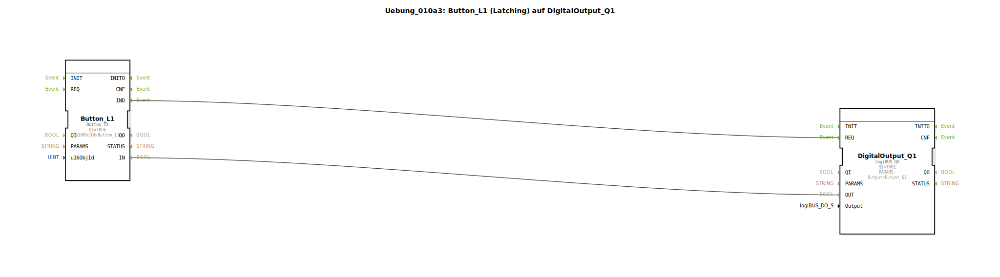

# Uebung_010a3: Button_L1 (Latching) auf DigitalOutput_Q1

Dieser Artikel beschreibt die logiBUS®-Übung `Uebung_010a3`.

----

## Ziel der Übung

Umgang mit zustandshaltenden Bedienelementen des Universal Terminals.

-----

## Beschreibung und Komponenten

[cite_start]In `Uebung_010a3.SUB` wird ein `Button_L1` (Latching) verwendet[cite: 1].

-----

## Funktionsweise

Ein "Latching Button" ist im ISOBUS-Objektpool so definiert, dass er seinen Zustand bei Betätigung speichert.

*   Erster Klick: Button rastet visuell ein, sendet dauerhaft `TRUE`.
*   Zweiter Klick: Button springt zurück, sendet dauerhaft `FALSE`.

Daher wird, wie im Kommentar vermerkt, **kein Software-Flip-Flop** (T_FF) in 4diac benötigt. Die Speicherfunktion wird vollständig vom ISOBUS-Terminal übernommen.