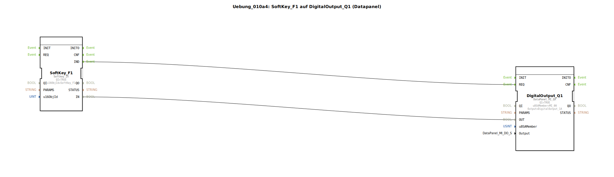

# Uebung_010a4: SoftKey_F1 auf DigitalOutput_Q1 (Datapanel)

Dieser Artikel beschreibt die logiBUS®-Übung `Uebung_010a4`.

## 🎧 Podcast

* [ISO 11783-6: Softkeys und das Virtual Terminal verstehen – Dein Schlüssel zur Landmaschinen-Mechatronik](https://podcasters.spotify.com/pod/show/isobus-vt-objects/episodes/ISO-11783-6-Softkeys-und-das-Virtual-Terminal-verstehen--Dein-Schlssel-zur-Landmaschinen-Mechatronik-e36a8b0)

----

## Ziel der Übung

Kombination verschiedener logiBUS-Teilsysteme.

-----

## Beschreibung und Komponenten

[cite_start]Die Subapplikation `Uebung_010a4.SUB` verbindet einen ISOBUS-Softkey mit einem physikalischen Ausgang eines DataPanels[cite: 1].

### Funktionsbausteine (FBs)

  * **`SoftKey_F1`**: Eingabequelle vom Traktor-Terminal.
  * **`DigitalOutput_Q1`**: Typ `DataPanel_MI_QX`. Dies ist ein Ausgang auf einer dezentralen IO-Box am CAN-Bus.

-----

## Funktionsweise

Diese Übung verdeutlicht die Mächtigkeit der IEC 61499 Abstraktion: Für die Programmlogik ist es völlig unerheblich, woher ein Signal kommt (Software-Terminal) oder wohin es geht (CAN-Modul). Die Ereignis- und Datenverbindungen überbrücken die Protokollgrenzen zwischen ISOBUS und gerätespezifischem CAN-Protokoll nahtlos.