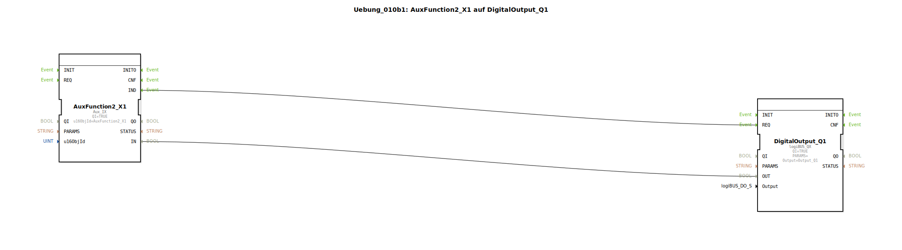

# Uebung_010b1: AuxFunction2_X1 auf DigitalOutput_Q1

Dieser Artikel beschreibt die logiBUS®-Übung `Uebung_010b1`. Hier wird die dritte Säule der ISOBUS-Bedienung eingeführt: Auxiliary Functions (AUX-N).

----

## Ziel der Übung

Anbindung von AUX-Eingabegeräten (z.B. ISOBUS-Joystick).

-----

## Beschreibung und Komponenten

[cite_start]In `Uebung_010b1.SUB` wird eine Auxiliary Function genutzt, um einen Ausgang zu schalten[cite: 1].

### Funktionsbausteine (FBs)

  * **`AuxFunction2_X1`**: Typ `isobus::UT::io::Auxiliary::IN::Aux_IX`. Dieser Baustein lauscht auf AUX-Nachrichten der "Funktion 2".

-----

## Funktionsweise

Im Gegensatz zu Softkeys, die ein festes Bildschirmelement sind, ist eine AUX-Funktion ein logisches Objekt. Der Bediener muss am Terminal (über das AUX-Menü) einmalig festlegen, welche physische Taste seines Joysticks er dieser "Funktion 2" zuweisen möchte. Sobald dieses "Teaching" abgeschlossen ist, triggert jeder Druck auf die Joystick-Taste den Baustein in 4diac.