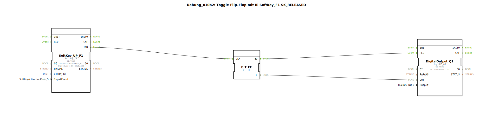

# Uebung_010b2: Toggle Flip-Flop mit IE SoftKey_F1 SK_RELEASED

Dieser Artikel beschreibt die logiBUS®-Übung `Uebung_010b2`.

## 🎧 Podcast

* [ISO 11783-6: Softkeys und das Virtual Terminal verstehen – Dein Schlüssel zur Landmaschinen-Mechatronik](https://podcasters.spotify.com/pod/show/isobus-vt-objects/episodes/ISO-11783-6-Softkeys-und-das-Virtual-Terminal-verstehen--Dein-Schlssel-zur-Landmaschinen-Mechatronik-e36a8b0)

----

## Ziel der Übung

Verwendung spezialisierter ISOBUS-Ereignisse zur Steuerung von Software-Flip-Flops.

-----

## Beschreibung und Komponenten

[cite_start]Die Subapplikation `Uebung_010b2.SUB` nutzt ein Flip-Flop, das durch das Loslassen eines Softkeys getriggert wird[cite: 1].

### Funktionsbausteine (FBs)

  * **`SoftKey_UP_F1`**: Typ `isobus::UT::io::Softkey::Softkey_IE`. Er ist auf das Ereignis `SK_RELEASED` konfiguriert.
  * **`E_T_FF`**: Toggle-Flip-Flop.

-----

## Funktionsweise

Das Ereignis `IND` wird erst gefeuert, wenn der Nutzer den Finger vom Softkey nimmt. Dies entspricht dem intuitiven Klick-Verhalten. Jeder vollständige Tastendruck (Drücken + Loslassen) schaltet das Licht um.