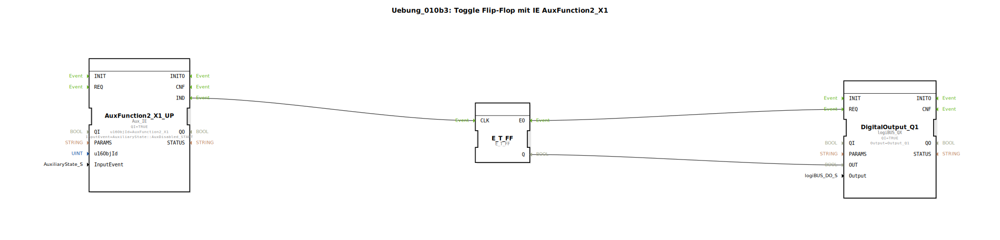

# Uebung_010b3: Toggle Flip-Flop mit IE AuxFunction2_X1

Dieser Artikel beschreibt die logiBUS®-Übung `Uebung_010b3`.

----

## Ziel der Übung

Verwendung von `Aux_IE` (Event) zur Steuerung von Speichern.

-----

## Beschreibung

[cite_start]In `Uebung_010b3.SUB` wird eine AUX-Funktion genutzt, um ein Flip-Flop zu toggeln[cite: 1].

### Funktionsweise

Es wird das Event `AuxDisabled_START` verwendet. In der ISOBUS-Terminologie bedeutet dies den Übergang in den Zustand "Deaktiviert". Das entspricht dem **Loslassen** einer Joystick-Taste. Das Flip-Flop wechselt also beim Loslassen der Taste seinen Zustand.