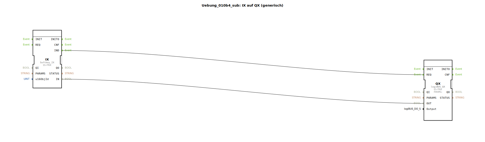

# Uebung_010b4_sub: IX auf QX (generisch)

## 🎧 Podcast

* [ISO 11783-6: Softkeys und das Virtual Terminal verstehen – Dein Schlüssel zur Landmaschinen-Mechatronik](https://podcasters.spotify.com/pod/show/isobus-vt-objects/episodes/ISO-11783-6-Softkeys-und-das-Virtual-Terminal-verstehen--Dein-Schlssel-zur-Landmaschinen-Mechatronik-e36a8b0)

## Übersicht

[cite_start]Dieser Sub-App-Typ dient der strukturierten Anbindung von ISOBUS-Softkeys an Hardware-Ausgänge[cite: 1].
Er bündelt eine `Softkey_IX` Instanz und einen `DigitalOutput_QX` Baustein. Über die Parameter `u16ObjId` und `Output` kann die Zuordnung zwischen virtuellem Button und physischer Lampe/Ventil direkt an der Sub-App vorgenommen werden. Dies ermöglicht den Aufbau von großen Bedien-Matrizen (wie in Übung 010b4 gezeigt) mit minimalem Verdrahtungsaufwand im Hauptdiagramm.

## 🛠️ Zugehörige Übungen

* [Uebung_010b4](Uebung_010b4.md)

