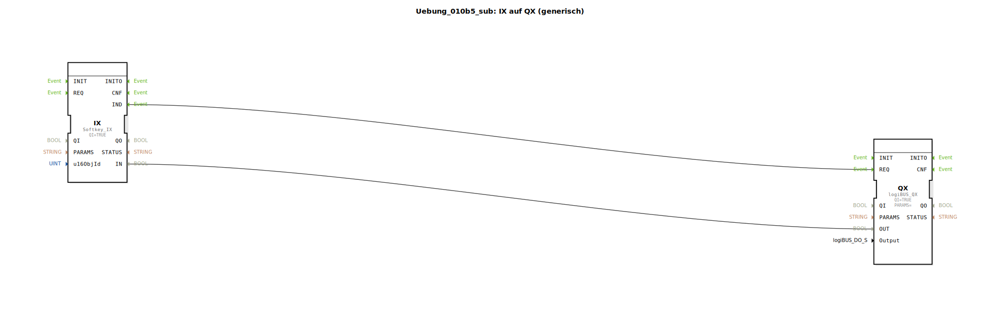

# Uebung_010b5_sub: IX auf QX (generisch)

## 🎧 Podcast

* [ISO 11783-6: Softkeys und das Virtual Terminal verstehen – Dein Schlüssel zur Landmaschinen-Mechatronik](https://podcasters.spotify.com/pod/show/isobus-vt-objects/episodes/ISO-11783-6-Softkeys-und-das-Virtual-Terminal-verstehen--Dein-Schlssel-zur-Landmaschinen-Mechatronik-e36a8b0)

## Übersicht

[cite_start]Dieser Typ ist funktional identisch mit `Uebung_010b4_sub` und dient der Skalierung der Anwendung auf 10 Kanäle[cite: 1]. Er ermöglicht die schnelle Integration von zusätzlichen Bedien-Elementen in das ISOBUS-Interface durch einfaches Kopieren und Parametrieren der Sub-App-Instanzen.

## 🛠️ Zugehörige Übungen

* [Uebung_010b5](Uebung_010b5.md)

