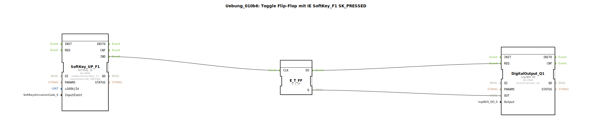

# Uebung_010b6: Toggle Flip-Flop mit IE SoftKey_F1 SK_PRESSED

Dieser Artikel beschreibt die logiBUS®-Übung `Uebung_010b6`.

## 🎧 Podcast

* [ISO 11783-6: Softkeys und das Virtual Terminal verstehen – Dein Schlüssel zur Landmaschinen-Mechatronik](https://podcasters.spotify.com/pod/show/isobus-vt-objects/episodes/ISO-11783-6-Softkeys-und-das-Virtual-Terminal-verstehen--Dein-Schlssel-zur-Landmaschinen-Mechatronik-e36a8b0)

----

## Ziel der Übung

Reaktion zum frühestmöglichen Zeitpunkt der Interaktion.

-----

## Funktionsweise

[cite_start]Verwendet das Event `SK_PRESSED`[cite: 1]. Das Flip-Flop am Ausgang toggelt bereits in dem Moment, in dem der Nutzer den Touchscreen berührt. Dies minimiert die gefühlte Latenz, verhindert aber ein nachträgliches Abbrechen durch Wegziehen des Fingers.