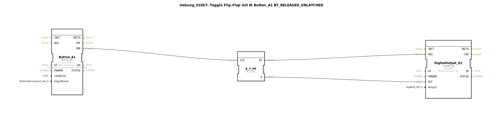

# Uebung_010b7: Toggle Flip-Flop mit IE Button_A1 BT_RELEASED_UNLATCHED

Dieser Artikel beschreibt die logiBUS®-Übung `Uebung_010b7`.

----

## Funktionsweise

[cite_start]Nutzt `Button_A1` mit dem Ereignis `BT_RELEASED_UNLATCHED`[cite: 1]. Das Event wird gefeuert, wenn ein normaler (nicht-rastender) Button auf der Arbeitsmaske losgelassen wird. Dies entspricht einem klassischen Mausklick-Ereignis.

