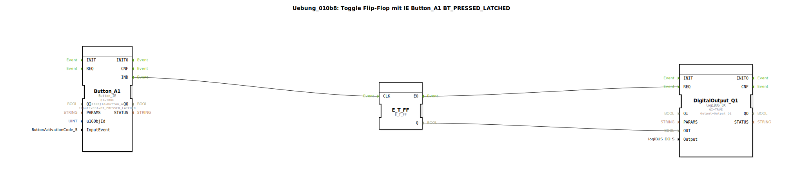

# Uebung_010b8: Toggle Flip-Flop mit IE Button_A1 BT_PRESSED_LATCHED

Dieser Artikel beschreibt die logiBUS®-Übung `Uebung_010b8`.

----

## Funktionsweise

[cite_start]Nutzt `Button_A1` mit `BT_PRESSED_LATCHED`[cite: 1]. Dieses Ereignis ist speziell für Buttons gedacht, die visuell einrasten sollen. Das Ereignis wird ausgelöst, sobald der Button in den Zustand "Aktiviert/Eingerastet" wechselt.

