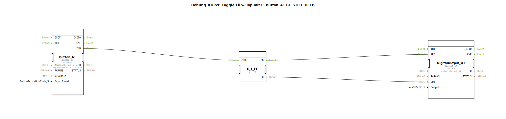

# Uebung_010b9: Toggle Flip-Flop mit IE Button_A1 BT_STILL_HELD

Dieser Artikel beschreibt die logiBUS®-Übung `Uebung_010b9`.

----

## Ziel der Übung

Nutzung repetierender Ereignisse zur Erzeugung von Blinksignalen oder Inkrement-Funktionen.

-----

## Funktionsweise

[cite_start]Nutzt `Button_A1` mit dem Ereignis `BT_STILL_HELD`[cite: 1]. Wie im Kommentar vermerkt, wird dieses Ereignis alle 200ms wiederholt, solange der Finger auf dem Button bleibt. Da das Signal an ein Toggle-Flip-Flop geleitet wird, blinkt der Hardware-Ausgang mit einer Periode von 400ms (200ms an, 200ms aus), solange gedrückt wird.

