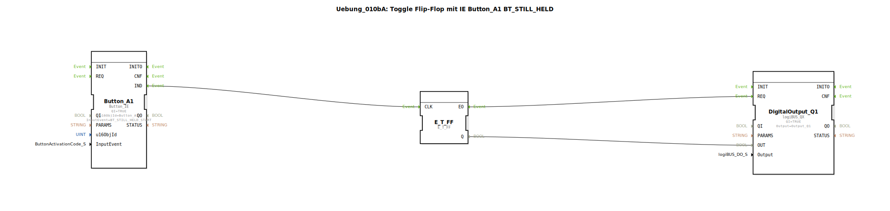

# Uebung_010bA: Toggle Flip-Flop mit IE Button_A1 BT_STILL_HELD

Dieser Artikel beschreibt die logiBUS®-Übung `Uebung_010bA`.

----

## Funktionsweise

[cite_start]Nutzt `Button_A1` mit `BT_STILL_HELD_START`[cite: 1]. Im Gegensatz zum einfachen `STILL_HELD` wird dieses Ereignis **nicht wiederholt**. Es feuert exakt einmal, sobald die Haltezeit überschritten wurde. Dies entspricht einer sauberen "Long Press" Auswertung.