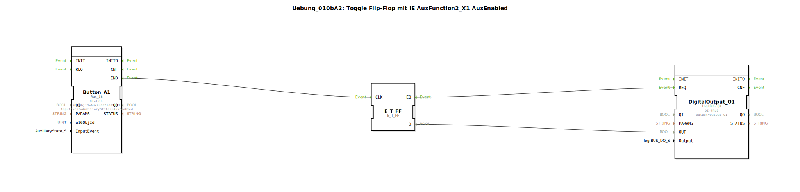

# Uebung_010bA2: Toggle Flip-Flop mit IE AuxFunction2_X1 AuxEnabled

Dieser Artikel beschreibt die logiBUS®-Übung `Uebung_010bA2`. Hier geht es um die Feinheiten der AUX-Spezifikation bezüglich rastender und tastender Eingänge.

----

## Funktionsweise

[cite_start]Verwendet `AuxFunction2_X1` mit dem Event `AuxEnabled`[cite: 1]. Das Verhalten hängt vom Typ des zugewiesenen Bedienelements (Joystick-Taste) ab:

*   Bei einem **tastenden Bediener** (NonLatched) wird das Event nur einmal beim Drücken gesendet.
*   Bei einem **rastenden Bediener** (Latched) wird das Event zyklisch wiederholt, solange der Schalter aktiv ist.
Dies verdeutlicht, wie die Software auf die Hardware-Eigenschaften des verwendeten Joysticks reagiert.