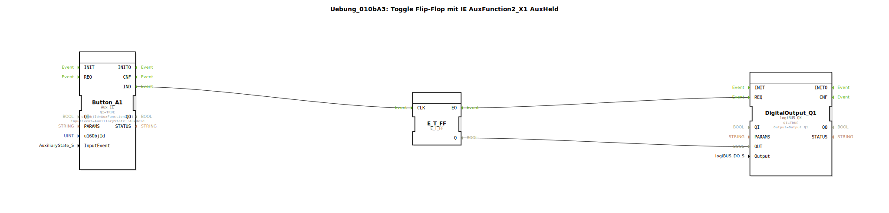

# Uebung_010bA3: Toggle Flip-Flop mit IE AuxFunction2_X1 AuxHeld

Dieser Artikel beschreibt die logiBUS®-Übung `Uebung_010bA3`.

----

## Funktionsweise

[cite_start]Nutzt `AuxFunction2_X1` mit `AuxHeld`[cite: 1]. Bei einem tastenden Bedienelement führt dieses Ereignis zu einer kontinuierlichen Event-Folge, solange die Taste am Joystick gehalten wird. In Kombination mit einem Toggle-Flip-Flop entsteht so ein Blink-Effekt am Ausgang.

