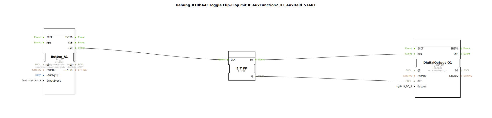

# Uebung_010bA4: Toggle Flip-Flop mit IE AuxFunction2_X1 AuxHeld_START

Dieser Artikel beschreibt die logiBUS®-Übung `Uebung_010bA4`.

----

## Funktionsweise

[cite_start]Nutzt `AuxFunction2_X1` mit `AuxHeld_START`[cite: 1]. Unabhängig vom Typ des Bedienelements wird dieses Ereignis nur **einmal** beim Erreichen der Zeitschwelle gesendet. Es ist die bevorzugte Wahl für Long-Press-Funktionen an ISOBUS-Joysticks.