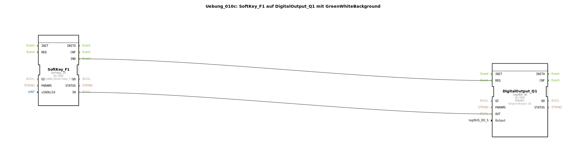

# Uebung_010c: SoftKey_F1 auf DigitalOutput_Q1 mit GreenWhiteBackground

Dieser Artikel beschreibt die logiBUS®-Übung `Uebung_010c`. Bisher dienten die Tasten nur der Eingabe. Jetzt erhalten sie eine dynamische Rückmeldung auf dem Bildschirm.

## 🎧 Podcast

* [ISO 11783-6: Softkeys und das Virtual Terminal verstehen – Dein Schlüssel zur Landmaschinen-Mechatronik](https://podcasters.spotify.com/pod/show/isobus-vt-objects/episodes/ISO-11783-6-Softkeys-und-das-Virtual-Terminal-verstehen--Dein-Schlssel-zur-Landmaschinen-Mechatronik-e36a8b0)

----

## Ziel der Übung

Rückmeldung an den Bediener durch Farbumschlag der virtuellen Taste.

-----

## Beschreibung und Komponenten

[cite_start]Die Subapplikation `Uebung_010c.SUB` erweitert die einfache Schaltung um einen Feedback-Baustein[cite: 1].

### Funktionsbausteine (FBs)

  * **`SoftKey_F1`**: Eingabe-Baustein.
  * **`GreenWhiteBackground` (SubApp)**: Ein Baustein aus der Bibliothek `MyLib::sys`. [cite_start]Er sorgt dafür, dass sich der Hintergrund des Softkeys auf dem Terminal ändert (Grün bei Aktivierung, Weiß im Ruhezustand)[cite: 1].
  * **`DigitalOutput_Q1`**: Der physische Ausgang.

-----

## Funktionsweise

Das Signal vom Softkey wird aufgeteilt:
1.  Ein Zweig geht zum physischen Ausgang `Q1`.
2.  Der zweite Zweig geht zum Feedback-Baustein.

Drückt der Nutzer die Taste, leuchtet nicht nur die Lampe an der Maschine, sondern die Taste auf dem Terminal-Bildschirm wird gleichzeitig grün hervorgehoben. Dies gibt dem Nutzer die Sicherheit, dass sein Befehl vom System registriert wurde.