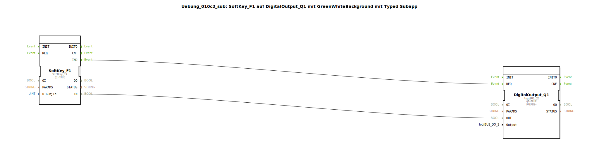

# Uebung_010c3_sub: SoftKey_F1 auf DigitalOutput_Q1 mit GreenWhiteBackground mit Typed Subapp

## 🎧 Podcast

* [ISO 11783-6: Softkeys und das Virtual Terminal verstehen – Dein Schlüssel zur Landmaschinen-Mechatronik](https://podcasters.spotify.com/pod/show/isobus-vt-objects/episodes/ISO-11783-6-Softkeys-und-das-Virtual-Terminal-verstehen--Dein-Schlssel-zur-Landmaschinen-Mechatronik-e36a8b0)

## Übersicht

[cite_start]Dieser Sub-App-Typ kombiniert eine Softkey-Eingabe mit einem automatischen visuellen Feedback auf dem Terminal[cite: 1].
Er bündelt die Bausteine `Softkey_IX`, `GreenWhiteBackground` und `DigitalOutput_QX`. Der Anwender muss lediglich die `u16ObjId` des Softkeys und den physischen `Output` angeben. Der Baustein stellt sicher, dass bei jeder Betätigung sowohl der Hardware-Ausgang geschaltet als auch der Hintergrund des Softkeys am Terminal farblich (Grün/Weiß) angepasst wird. Dies reduziert den Projektierungsaufwand bei komplexen Bedienoberflächen erheblich.

## 🛠️ Zugehörige Übungen

* [Uebung_010c3](Uebung_010c3.md)

