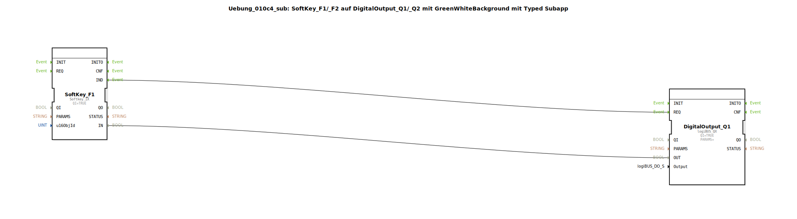

# Uebung_010c4_sub: SoftKey_F1/_F2 auf DigitalOutput_Q1/_Q2 mit GreenWhiteBackground mit Typed Subapp

## 🎧 Podcast

* [ISO 11783-6: Softkeys und das Virtual Terminal verstehen – Dein Schlüssel zur Landmaschinen-Mechatronik](https://podcasters.spotify.com/pod/show/isobus-vt-objects/episodes/ISO-11783-6-Softkeys-und-das-Virtual-Terminal-verstehen--Dein-Schlssel-zur-Landmaschinen-Mechatronik-e36a8b0)

## Übersicht

[cite_start]Dieser Typ ist funktional identisch mit `Uebung_010c3_sub` und dient der sauberen Strukturierung von mehrkanaligen Feedback-Anwendungen[cite: 1]. Durch die Kapselung in einen Typ können beliebig viele Softkey-Ausgangs-Kombinationen mit integriertem Farbumschlag schnell und fehlerfrei erstellt werden.

## 🛠️ Zugehörige Übungen

* [Uebung_010c4](Uebung_010c4.md)

