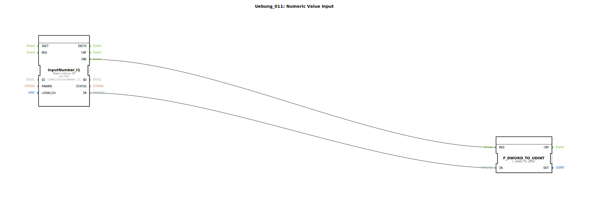

# Uebung_011: Numeric Value Input


[](https://notebooklm.google.com/notebook/a6872e59-1dfc-4132-a118-aff1bc7bc944)

Dieser Artikel beschreibt die logiBUS®-Übung `Uebung_011`. Hier wird demonstriert, wie Zahlenwerte (Daten) von einem ISOBUS-Terminal eingelesen werden.

## 🎧 Podcast




* [ISO 11783-6: Softkeys und das Virtual Terminal verstehen – Dein Schlüssel zur Landmaschinen-Mechatronik](https://podcasters.spotify.com/pod/show/isobus-vt-objects/episodes/ISO-11783-6-Softkeys-und-das-Virtual-Terminal-verstehen--Dein-Schlssel-zur-Landmaschinen-Mechatronik-e36a8b0)
* [Die drei Timer der DIN EN 61131-3 entschlüsselt – TP, TON & TOF präzise erklärt](https://podcasters.spotify.com/pod/show/iec-61499-grundkurs-de/episodes/Die-drei-Timer-der-DIN-EN-61131-3-entschlsselt--TP--TON--TOF-przise-erklrt-e3dma77)
* [DIN EN 61131-3 vs. 61499-1: Dein Wegweiser durch die Normen der Industrieautomatisierung](https://podcasters.spotify.com/pod/show/iec-61499-grundkurs-de/episodes/DIN-EN-61131-3-vs--61499-1-Dein-Wegweiser-durch-die-Normen-der-Industrieautomatisierung-e36c6nc)
* [DIN EN 61131-3: Das Herz der Land- und Baumaschinen-Mechatronik und der Sprung in die Zukunft mit Ob](https://podcasters.spotify.com/pod/show/iec-61499-grundkurs-de/episodes/DIN-EN-61131-3-Das-Herz-der-Land--und-Baumaschinen-Mechatronik-und-der-Sprung-in-die-Zukunft-mit-Ob-e36c2mp)
* [FB_TOF und E_TOF: Verzögerungstimer in IEC 61131-3 und 61499](https://podcasters.spotify.com/pod/show/iec-61499-grundkurs-de/episodes/FB_TOF-und-E_TOF-Verzgerungstimer-in-IEC-61131-3-und-61499-e368e2d)

----


## Ziel der Übung

Erlernen der Verarbeitung von numerischen Variablen im ISOBUS-Kontext. Es wird gezeigt, wie ein Nutzer am Terminal eine Zahl eingeben kann und wie diese Information als Daten-Ereignis-Kombination in der Steuerung ankommt.

-----

## Beschreibung und Komponenten

[cite_start]Die Subapplikation `Uebung_011.SUB` nutzt einen Eingabe-Baustein für numerische Werte[cite: 1].

### Funktionsbausteine (FBs)

  * **`InputNumber_I1`**: Typ `NumericValue_ID`. [cite_start]Dieser Baustein repräsentiert ein numerisches Eingabefeld (Data Mask Object) auf dem ISOBUS-Terminal[cite: 1]. Sobald der Nutzer die Eingabe bestätigt, sendet der Baustein den neuen Wert am Port `IN` (DWORD) und feuert ein `IND`-Ereignis.
  * **`F_DWORD_TO_UDINT`**: Ein Konvertierungs-Baustein, der den rohen 32-Bit-Wert vom Terminal in einen vorzeichenlosen Ganzzahlwert (UDINT) für die weitere Logik umwandelt.

-----

## Funktionsweise

Die Logik wartet auf die Bestätigung der Eingabe am Terminal:

```xml
<EventConnections>
    <Connection Source="InputNumber_I1.IND" Destination="F_DWORD_TO_UDINT.REQ"/>
</EventConnections>
<DataConnections>
    <Connection Source="InputNumber_I1.IN" Destination="F_DWORD_TO_UDINT.IN"/>
</DataConnections>
```

[cite_start][cite: 1]

1.  Der Nutzer tippt am Terminal auf das Zahlenfeld `I1`, gibt z.B. "42" ein und drückt "Enter".
2.  Das Terminal sendet den Wert über den CAN-Bus an die Steuerung.
3.  Der Baustein `InputNumber_I1` empfängt den Wert und löst das Ereignis `IND` aus.
4.  Der Konvertierungs-Baustein übernimmt den Wert und stellt ihn der restlichen Applikation als Standard-Datentyp zur Verfügung.

-----

## Anwendungsbeispiel

**Einstellung von Sollwerten**:
Der Landwirt gibt am Terminal die gewünschte Ausbringmenge für Saatgut (in kg/ha) oder die Zieltemperatur für die Getreidetrocknung ein. Die Software verarbeitet diesen numerischen Wert sofort weiter.