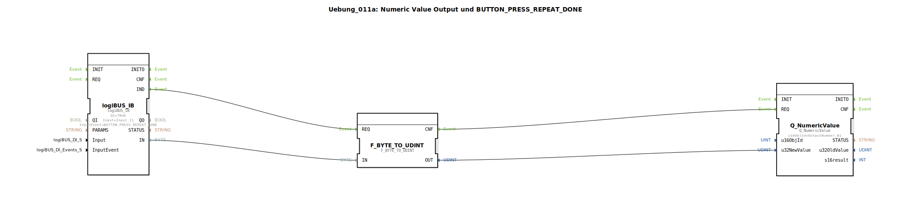

# Uebung_011a: Numeric Value Output und BUTTON_PRESS_REPEAT_DONE

Dieser Artikel beschreibt die logiBUS®-Übung `Uebung_011a`. Hier wird die Interaktion zwischen Taster-Ereignissen und numerischen Anzeigen auf dem Terminal vertieft.

----

## Ziel der Übung

Nutzung des `BUTTON_PRESS_REPEAT_DONE` Ereignisses zur Aktualisierung eines Anzeige-Objekts.

-----

## Beschreibung und Komponenten

[cite_start]In `Uebung_011a.SUB` wird ein Byte-Wert von einem Taster eingelesen und an eine numerische Anzeige am Terminal gesendet[cite: 1].

### Funktionsbausteine (FBs)

  * **`logiBUS_IB`**: Eingangsbaustein für Byte-Werte. Er ist auf das Event `BUTTON_PRESS_REPEAT_DONE` konfiguriert.
  * **`Q_NumericValue`**: Ausgangsbaustein zur Anzeige einer Zahl auf dem Terminal.

-----

## Funktionsweise

Das Besondere ist die Wahl des Eingangs-Ereignisses:
*   **`BUTTON_PRESS_REPEAT`**: Würde während des Drückens ständig Ereignisse senden (Blinker-Effekt).
*   **`BUTTON_PRESS_REPEAT_DONE`**: Feuert nur **ein einziges Mal**, nämlich dann, wenn der Nutzer den Taster nach einer (eventuell wiederholten) Betätigung endgültig loslässt.

Die Logik sorgt dafür, dass der aktuelle Byte-Wert des Tasters (z.B. eine ID oder ein Zählerstand) erst am Ende der Interaktion an das Terminal übertragen wird.

-----

## Anwendungsbeispiel

**Zähler-Übertragung**:
Ein Bediener hält einen Taster gedrückt, um einen Wert intern hochzuzählen. Damit der CAN-Bus nicht durch ständige Display-Updates belastet wird, erfolgt die Aktualisierung der Anzeige auf dem Terminal erst dann, wenn der Finger weggenommen wird (`REPEAT_DONE`).