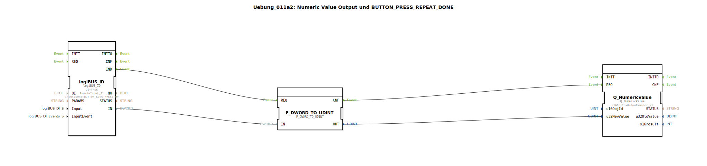

# Uebung_011a2: Numeric Value Output und BUTTON_PRESS_REPEAT_DONE

Dieser Artikel beschreibt die logiBUS®-Übung `Uebung_011a2`.

----

## Übersicht

[cite_start]Strukturell identisch mit `Uebung_011a`, verwendet diese Variante das Ereignis `BUTTON_LONG_PRESS_UP` am Eingangsbaustein `logiBUS_ID`[cite: 1]. Die Anzeige auf dem Terminal wird hier erst dann aktualisiert, wenn ein zuvor erkannter langer Tastendruck durch Loslassen beendet wurde. Dies demonstriert eine weitere Variante der Interaktions-Bestätigung für numerische Werte.

