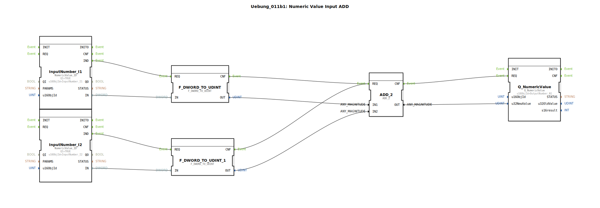

# Uebung_011b1: Numeric Value Input ADD

* * * * * * * * * *

## Einleitung

Diese Übung demonstriert die Verarbeitung zweier numerischer Eingabewerte über den ISOBUS (UT). Die Werte werden als `DWORD` empfangen, in `UDINT` konvertiert, addiert und das Ergebnis als numerischer Ausgabewert bereitgestellt. Sie dient als einführendes Beispiel für die Kombination von Datentypkonvertierung, arithmetischen Operationen und der Nutzung der ISOBUS-NumericValue-Schnittstelle.

## Verwendete Funktionsbausteine (FBs)

- **InputNumber_I1** / **InputNumber_I2**  
  - **Typ**: `isobus::UT::io::NumericValue::NumericValue_ID`  
  - **Parameter**:  
    - `QI` = `TRUE` (Eingang aktiviert)  
    - `u16ObjId` = `"InputNumber_I1"` bzw. `"InputNumber_I2"` (jeweilige Objekt-ID)  
  - **Funktion**: Stellt einen numerischen Eingabewert über den ISOBUS bereit. Bei einem eingehenden Ereignis (IND) wird der aktuelle Wert am Datenausgang `IN` (vom Typ `DWORD`) ausgegeben.

- **F_DWORD_TO_UDINT** / **F_DWORD_TO_UDINT_1**  
  - **Typ**: `iec61131::conversion::F_DWORD_TO_UDINT`  
  - **Parameter**: keine  
  - **Funktion**: Konvertiert einen `DWORD`-Wert in einen `UDINT`-Wert. Der konvertierte Wert wird am Ausgang `OUT` ausgegeben. Die Konvertierung wird durch ein Ereignis am Eingang `REQ` gestartet; nach Abschluss wird der Ausgang `CNF` aktiviert.

- **ADD_2**  
  - **Typ**: `iec61131::arithmetic::ADD_2`  
  - **Parameter**: keine  
  - **Funktion**: Addiert zwei `UDINT`-Werte an den Eingängen `IN1` und `IN2`. Das Ergebnis wird am Ausgang `OUT` (ebenfalls `UDINT`) ausgegeben. Ein Ereignis an `REQ` startet die Berechnung; nach Fertigstellung wird `CNF` aktiviert.

- **Q_NumericValue**  
  - **Typ**: `isobus::UT::Q::Q_NumericValue`  
  - **Parameter**:  
    - `u16ObjId` = `"OutputNumber_N1"`  
  - **Funktion**: Sendet einen numerischen Wert über den ISOBUS. Der zu sendende Wert wird am Daten-Eingang `u32NewValue` (vom Typ `UDINT`) erwartet. Ein Ereignis an `REQ` löst die Ausgabe aus; der Ausgang `CNF` bestätigt die erfolgreiche Übertragung.

## Programmablauf und Verbindungen

Der Ablauf wird durch die Ereignis- und Datenverbindungen im Netzwerk gesteuert:

1. **Eingabe der Werte** – Die Funktionsbausteine `InputNumber_I1` und `InputNumber_I2` warten auf eingehende ISOBUS-Nachrichten. Sobald ein Wert anliegt, wird das Ereignis `IND` ausgelöst.  
2. **Konvertierung** – Das Ereignis `IND` von `InputNumber_I1` triggert `F_DWORD_TO_UDINT` (über `REQ`). Gleichzeitig wird `F_DWORD_TO_UDINT_1` durch das `IND` von `InputNumber_I2` getriggert. Die konvertierten `UDINT`-Werte stehen an den Ausgängen `OUT` der Konverter an.  
3. **Addition** – Nach Abschluss der Konvertierung (jeweiliges `CNF`-Ereignis) wird der Funktionsbaustein `ADD_2` über seinen Eingang `REQ` aufgerufen. Die konvertierten Werte der beiden Konverter werden mit den Datenverbindungen an `IN1` und `IN2` von `ADD_2` übergeben.  
4. **Ausgabe** – Das `CNF`-Ereignis von `ADD_2` triggert den Baustein `Q_NumericValue`. An dessen Dateneingang `u32NewValue` liegt das Additionsergebnis an. Der Baustein sendet diesen Wert über den ISOBUS an die Objekt-ID `OutputNumber_N1`.

Hinweise für den Nutzer:
- Die Objekt-IDs (`InputNumber_I1`, `InputNumber_I2`, `OutputNumber_N1`) müssen mit den im ISOBUS‑System konfigurierten Objekten übereinstimmen.
- Die Übung setzt Grundkenntnisse in der 4diac-IDE und der IEC 61499‑Ereignissteuerung voraus.
- Schwierigkeitsgrad: Einsteiger.

## Zusammenfassung

Die Übung **Uebung_011b1** veranschaulicht den gesamten Datenpfad von der ISOBUS-Eingabe über Datentypkonvertierung und arithmetische Verarbeitung bis zur ISOBUS-Ausgabe. Sie ist ein typisches Beispiel für die strukturierte, ereignisgesteuerte Programmierung mit 4diac und IEC 61499. Die klare Trennung von Ereignis- und Datenflüssen erleichtert das Verständnis und die Wiederverwendbarkeit der Bausteine.