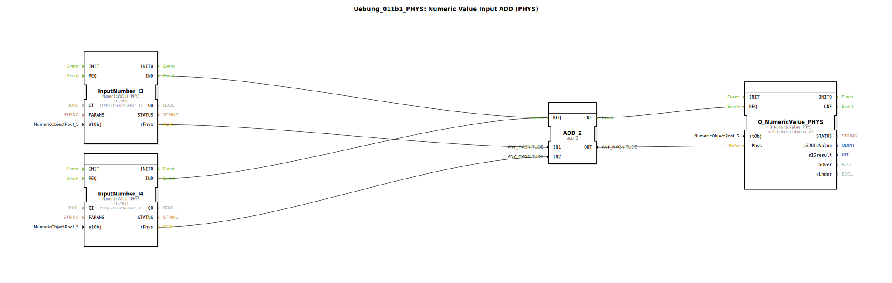

# Uebung_011b1_PHYS: Numeric Value Input ADD (PHYS)

* * * * * * * * * *
## Einleitung

In dieser Übung wird eine Addition von zwei physikalischen Werten (REAL) mithilfe des NumericValue-Patterns aus der isobus-Bibliothek realisiert. Die Werte werden über die Bausteine `InputNumber_I3` und `InputNumber_I4` eingelesen, addiert und das Ergebnis über den Baustein `Q_NumericValue_PHYS` ausgegeben.

## Verwendete Funktionsbausteine (FBs)

- **InputNumber_I3** (Typ: `isobus::UT::io::NumericValue::NumericValue_PHYS`)
    - Parameter:
        - `QI` = `TRUE`
        - `stObj` = `InputNumber_I3`
    - Ereignisausgang: `IND` (Indication) – wird bei einer Wertänderung ausgelöst
    - Datenausgang: `rPhys` (REAL) – der aktuelle physikalische Wert

- **InputNumber_I4** (Typ: `isobus::UT::io::NumericValue::NumericValue_PHYS`)
    - Parameter:
        - `QI` = `TRUE`
        - `stObj` = `InputNumber_I4`
    - Ereignisausgang: `IND`
    - Datenausgang: `rPhys`

- **ADD_2** (Typ: `iec61131::arithmetic::ADD_2`)
    - Parameter: keine
    - Ereigniseingang: `REQ` (Request) – löst die Addition aus
    - Ereignisausgang: `CNF` (Confirmation) – signalisiert die fertige Berechnung
    - Dateneingänge: `IN1` (REAL), `IN2` (REAL)
    - Datenausgang: `OUT` (REAL) – Summe der beiden Eingangswerte

- **Q_NumericValue_PHYS** (Typ: `isobus::UT::Q::Q_NumericValue_PHYS`)
    - Parameter:
        - `stObj` = `OutputNumber_N3`
    - Ereigniseingang: `REQ` – übernimmt den Wert bei Ereignis
    - Dateneingang: `rPhys` (REAL) – der zu setzende physikalische Wert

### Funktionsweise

Die beiden Eingangsbausteine liefern bei einer Wertänderung ein Ereignis (`IND`). Dieses Ereignis wird an den Addierer `ADD_2` gesendet (`REQ`). Gleichzeitig werden die aktuellen physikalischen Werte (`rPhys`) an die Dateneingänge `IN1` und `IN2` von `ADD_2` übergeben. Nach der Berechnung sendet `ADD_2` eine Bestätigung (`CNF`) an den Ausgangsbaustein `Q_NumericValue_PHYS`, der das Ergebnis übernimmt und intern speichert.

## Programmablauf und Verbindungen

Der Ablauf ist ereignisgesteuert:

1. Wenn sich der Wert an `InputNumber_I3` oder `InputNumber_I4` ändert, wird das `IND`-Ereignis ausgelöst.
2. Beide `IND`-Ereignisse sind mit dem `REQ`-Eingang von `ADD_2` verbunden (ODER-Verknüpfung – bereits eines löst die Addition aus).
3. `ADD_2` addiert die beiden REAL-Werte und gibt das Ergebnis an `OUT` aus.
4. Nach der Addition sendet `ADD_2` das `CNF`-Ereignis, welches den Baustein `Q_NumericValue_PHYS` triggert, den Ausgangswert zu setzen.

**Datenverbindungen**:
- `InputNumber_I3.rPhys` → `ADD_2.IN1`
- `InputNumber_I4.rPhys` → `ADD_2.IN2`
- `ADD_2.OUT` → `Q_NumericValue_PHYS.rPhys`

**Ereignisverbindungen**:
- `InputNumber_I3.IND` → `ADD_2.REQ`
- `InputNumber_I4.IND` → `ADD_2.REQ`
- `ADD_2.CNF` → `Q_NumericValue_PHYS.REQ`

## Zusammenfassung

Die Übung demonstriert die Verwendung von physikalischen Werten (REAL) mit dem NumericValue-Pattern aus der isobus-Bibliothek. Zwei Eingänge werden addiert und das Ergebnis an einen Ausgang weitergegeben. Die PHYS-Variante arbeitet mit Gleitkommazahlen und ermöglicht so die Verarbeitung von kontinuierlichen Messwerten. Die ereignisgesteuerte Ausführung stellt sicher, dass die Berechnung nur bei Änderungen durchgeführt wird.