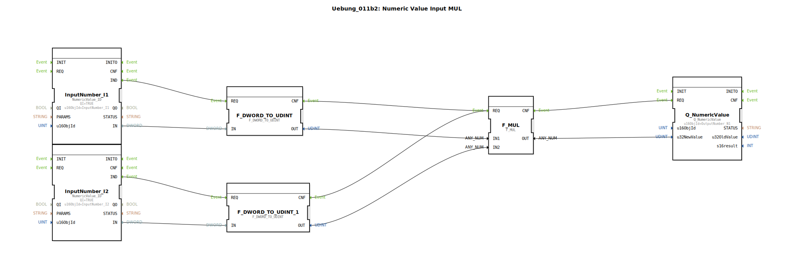

# Uebung_011b2: Numeric Value Input MUL

*Bild folgt (sofern vorhanden)*

* * * * * * * * * *

## Einleitung

Die Übung **Uebung_011b2** realisiert eine einfache Multiplikation zweier numerischer Werte. Zwei Eingänge (InputNumber\_I1 und InputNumber\_I2) lesen je einen DWORD-Wert aus dem ISOBUS-Netzwerk, wandeln diesen in den Datentyp UDINT um und multiplizieren die Ergebnisse miteinander. Das Produkt wird über einen Ausgang (OutputNumber\_N1) wieder auf den Bus geschrieben. Die Übung zeigt die Verwendung von Ein-/Ausgabe-FB für numerische Werte und die arithmetische Verknüpfung über IEC 61131-Funktionsbausteine.

## Verwendete Funktionsbausteine (FBs)

- **InputNumber\_I1** (Typ: `isobus::UT::io::NumericValue::NumericValue_ID`)  
  - Parameter: `QI` = `TRUE`, `u16ObjId` = `InputNumber_I1`  
  - Ereignisausgang: `IND`  
  - Datenausgang: `IN` (DWORD)  
  - Funktion: Liest den aktuellen numerischen Wert des ISOBUS-Objekts „InputNumber_I1“ und stellt ihn als DWORD bereit.

- **InputNumber\_I2** (Typ: `isobus::UT::io::NumericValue::NumericValue_ID`)  
  - Parameter: `QI` = `TRUE`, `u16ObjId` = `InputNumber_I2`  
  - Ereignisausgang: `IND`  
  - Datenausgang: `IN` (DWORD)  
  - Funktion: Liest den aktuellen numerischen Wert des ISOBUS-Objekts „InputNumber_I2“ und stellt ihn als DWORD bereit.

- **F\_DWORD\_TO\_UDINT** (Typ: `iec61131::conversion::F_DWORD_TO_UDINT`)  
  - Ereigniseingang: `REQ`, Ereignisausgang: `CNF`  
  - Dateneingang: `IN` (DWORD), Datenausgang: `OUT` (UDINT)  
  - Funktion: Wandelt den eingehenden DWORD-Wert in einen vorzeichenlosen 32-Bit-Integer (UDINT) um.

- **F\_DWORD\_TO\_UDINT\_1** (Typ: `iec61131::conversion::F_DWORD_TO_UDINT`)  
  - Gleiche Konfiguration und Funktion wie oben, dient der Umwandlung des zweiten Eingangswerts.

- **F\_MUL** (Typ: `iec61131::arithmetic::F_MUL`)  
  - Ereigniseingang: `REQ`, Ereignisausgang: `CNF`  
  - Dateneingänge: `IN1`, `IN2` (beide UDINT), Datenausgang: `OUT` (UDINT)  
  - Funktion: Multipliziert die beiden eingehenden UDINT-Werte und gibt das Produkt als UDINT aus.

- **Q\_NumericValue** (Typ: `isobus::UT::Q::Q_NumericValue`)  
  - Parameter: `u16ObjId` = `OutputNumber_N1`  
  - Ereigniseingang: `REQ`  
  - Dateneingang: `u32NewValue` (UDINT)  
  - Funktion: Schreibt den übergebenen numerischen Wert auf das ISOBUS-Objekt „OutputNumber_N1“.

## Programmablauf und Verbindungen

1. **Ereignissteuerung**:  
   - Sobald `InputNumber_I1` einen neuen Wert liefert, feuert dessen Ereignisausgang `IND`. Dieses Ereignis wird zum `REQ`-Eingang von `F_DWORD_TO_UDINT` verbunden.  
   - Gleichzeitig triggert `InputNumber_I2.IND` den zweiten Umwandler `F_DWORD_TO_UDINT_1`.  
   - Nach Abschluss der jeweiligen Konvertierung feuern die `CNF`-Ausgänge beider Umwandler – beide verbunden mit dem `REQ`-Eingang von `F_MUL`. (Hinweis: Die beiden Ereignisse werden beim Verbinden implizit ODER-verknüpft, sodass jede neue Eingabe eine Neuberechnung auslöst.)  
   - Nach der Multiplikation feuert `F_MUL.CNF` und triggert den Ausgangs-FB `Q_NumericValue`.

2. **Datenfluss**:  
   - Die Datenausgänge `IN` der Eingabe-FBs werden direkt auf die Dateneingänge `IN` der jeweiligen Umwandler gelegt.  
   - Die Ausgänge `OUT` der Umwandler (UDINT) gelangen an `F_MUL.IN1` (aus `I1`) bzw. `F_MUL.IN2` (aus `I2`).  
   - Das Produkt `F_MUL.OUT` wird auf den Eingang `u32NewValue` von `Q_NumericValue` geschrieben und dort auf den Bus ausgegeben.

Die gesamte Logik ist ereignisgesteuert: Sobald ein neuer Messwert an einem der Eingänge anliegt, wird die gesamte Kette durchlaufen und der Ausgang aktualisiert.

## Zusammenfassung

Die Übung demonstriert den Umgang mit ISOBUS-NumericValue-FBs und IEC 61131-Konvertierungs- sowie Arithmetikbausteinen in einer 4diac-Subapplikation. Ziel ist die einfache Multiplikation zweier Buswerte. Durch die getrennte Ereignisverkettung wird sichergestellt, dass jeder neue Eingangswert sofort verarbeitet wird. Die Übung eignet sich als Grundlage für komplexere Berechnungen mit mehreren Eingängen und Ausgängen.