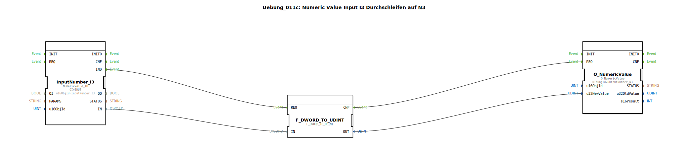

# Uebung_011c: Numeric Value Input I3 Durchschleifen auf N3

* * * * * * * * * *
## Einleitung

Diese Übung demonstriert das einfache Durchschleifen eines numerischen Werts von einem ISOBUS-Input-Objekt (InputNumber_I3) zu einem Output-Objekt (OutputNumber_N3). Dabei wird der vom Bus kommende DWORD-Wert in einen UDINT konvertiert, bevor er an das Ausgangsobjekt weitergegeben wird. Die Übung ist ein grundlegendes Beispiel für den Umgang mit dem **4diac-IDE** im Kontext von ISOBUS (ISO 11783) und zeigt, wie Funktionsbausteine zur Datenverarbeitung und -weiterleitung verschaltet werden.

## Verwendete Funktionsbausteine (FBs)

### InputNumber_I3
- **Typ**: `isobus::UT::io::NumericValue::NumericValue_ID`
- **Parameter**:
  - `QI` = `TRUE`
  - `u16ObjId` = `InputNumber_I3`
- **Ereigniseingänge**: (implizit durch den Typ, Standard: INIT, REQ, etc.)
- **Ereignisausgänge**: `IND` (wird ausgelöst, wenn ein neuer Wert vom Bus ankommt)
- **Dateneingänge**: (keine zusätzlichen außer den impliziten)
- **Datenausgänge**: `IN` (ausgehender Wert als DWORD)
- **Funktionsweise**: Dieser FB liest den aktuellen Wert des ISOBUS-Objekts mit der ID `InputNumber_I3`. Bei jeder Wertänderung am Bus wird das Ereignis `IND` ausgelöst und der aktuelle Wert als DWORD am Ausgang `IN` bereitgestellt.

### F_DWORD_TO_UDINT
- **Typ**: `iec61131::conversion::F_DWORD_TO_UDINT`
- **Parameter**: keine zusätzlichen
- **Ereigniseingänge**: `REQ` (Konvertierung anfordern)
- **Ereignisausgänge**: `CNF` (Bestätigung nach erfolgreicher Konvertierung)
- **Dateneingänge**: `IN` (DWORD-Wert)
- **Datenausgänge**: `OUT` (konvertierter UDINT-Wert)
- **Funktionsweise**: Der FB wandelt den 32-Bit DWORD in einen vorzeichenlosen 32-Bit Integer (UDINT) um. Die Konvertierung wird durch ein Ereignis an `REQ` gestartet; nach Abschluss wird `CNF` ausgelöst.

### Q_NumericValue
- **Typ**: `isobus::UT::Q::Q_NumericValue`
- **Parameter**:
  - `u16ObjId` = `OutputNumber_N3`
- **Ereigniseingänge**: `REQ` (Wert schreiben anfordern)
- **Ereignisausgänge**: (keine expliziten Ausgänge im Netzwerk)
- **Dateneingänge**: `u32NewValue` (UDINT-Wert, der geschrieben werden soll)
- **Datenausgänge**: keine
- **Funktionsweise**: Dieser FB schreibt einen neuen Wert (UDINT) auf das ISOBUS-Objekt mit der ID `OutputNumber_N3`. Bei einem Ereignis an `REQ` wird der anliegende Wert an den Bus übertragen.

## Programmablauf und Verbindungen

Die Verschaltung erfolgt in einer einfachen Ereignis- und Datenkette:

1. **Ereignisverbindungen**:
   - `InputNumber_I3.IND` → `F_DWORD_TO_UDINT.REQ`
   - `F_DWORD_TO_UDINT.CNF` → `Q_NumericValue.REQ`

2. **Datenverbindungen**:
   - `InputNumber_I3.IN` → `F_DWORD_TO_UDINT.IN`
   - `F_DWORD_TO_UDINT.OUT` → `Q_NumericValue.u32NewValue`

**Ablauf**:
- Sobald das ISOBUS-Objekt `InputNumber_I3` einen neuen Wert vom Bus erhält (z. B. durch ein externes Steuergerät), wird das Ereignis `IND` am FB `InputNumber_I3` ausgelöst.
- Dieses Ereignis triggert die Konvertierung im FB `F_DWORD_TO_UDINT` (über dessen `REQ`-Eingang).
- Nach Abschluss der Konvertierung gibt `F_DWORD_TO_UDINT` das Ereignis `CNF` aus, welches den FB `Q_NumericValue` anstößt, den konvertierten Wert auf das Ausgangsobjekt `OutputNumber_N3` zu schreiben.

Somit wird der eingehende Wert nahezu verzögerungsfrei (nur durch die Konvertierung verzögert) an das Ausgangsobjekt weitergereicht.

## Zusammenfassung

Die Übung **Uebung_011c** zeigt die grundlegende Datenflussverarbeitung mit 4diac unter Verwendung von ISOBUS-Funktionsbausteinen. Sie vermittelt:

- Einlesen eines numerischen Werts von einem ISOBUS-Objekt,
- Datentypkonvertierung (DWORD → UDINT),
- Ausgabe des konvertierten Werts auf ein zweites Objekt,
- Ereignisgesteuerte Verkettung von FB-Instanzen.

Dieses einfache Durchschleifen kann als Basis für komplexere Signalverarbeitungsketten dienen, bei denen Werte zwischen verschiedenen Busteilnehmern ausgetauscht und gegebenenfalls skaliert oder umgewandelt werden müssen.