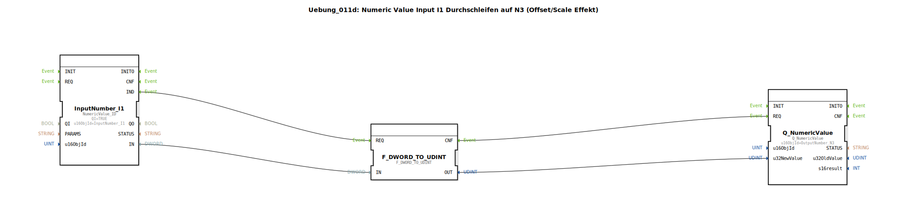

# Uebung_011d: Numeric Value Input I1 Durchschleifen auf N3 (Offset/Scale Effekt)

* * * * * * * * * *

## Einleitung

In dieser Übung wird ein numerischer Wert von einem Eingabegerät (I1) gelesen und unverändert an ein Ausgabegerät (N3) weitergeleitet. Durch die Verwendung eines Konvertierungsbausteins wird der eingehende 32‑Bit‑Wert von `DWORD` in `UDINT` umgewandelt. Diese Typumwandlung führt zu einem Offset‑/Skalierungseffekt, der die Ausgabe gegenüber dem Rohwert verschiebt.

Ein Beispiel verdeutlicht den Effekt:  
- Eingabe 100 000 → N3 zeigt 0,00  
- Eingabe 50 000 → N3 zeigt −500,00  

Die Übung zeigt die grundlegende Handhabung der `NumericValue`-Schnittstelle und die Auswirkungen von Datentypkonvertierungen.

---

## Verwendete Funktionsbausteine (FBs)

Im Netzwerk der Übung werden drei Funktionsbausteine eingesetzt. Es sind keine Sub‑Bausteine vorhanden.

| Name | Typ | Parameter |
|------|-----|-----------|
| `InputNumber_I1` | `isobus::UT::io::NumericValue::NumericValue_ID` | `QI = TRUE`, `u16ObjId = "InputNumber_I1"` |
| `F_DWORD_TO_UDINT` | `iec61131::conversion::F_DWORD_TO_UDINT` | (keine Parameter) |
| `Q_NumericValue` | `isobus::UT::Q::Q_NumericValue` | `u16ObjId = "OutputNumber_N3"` |

- **`InputNumber_I1`** – Liest einen numerischen Rohwert vom Eingang I1 als `DWORD` (32‑Bit) ein und stellt ihn am Datenausgang `IN` sowie ein Ereignis `IND` bei neuer Datenbereitstellung bereit.
- **`F_DWORD_TO_UDINT`** – Konvertiert den empfangenen `DWORD`-Wert in eine vorzeichenlose 32‑Bit‑Integer (`UDINT`). Die Umwandlung verändert die Interpretation der Bitfolge und erzeugt den beschriebenen Offset.
- **`Q_NumericValue`** – Nimmt den konvertierten `UDINT`-Wert über den Dateneingang `u32NewValue` entgegen und stellt ihn am Ausgang N3 dar. Der Baustein wird durch ein Ereignis an `REQ` getriggert.

---

## Programmablauf und Verbindungen

Die Verarbeitung erfolgt ereignisgesteuert:

1. **Ereigniskette**  
   - `InputNumber_I1` sendet bei einem neuen Eingabewert das Ereignis `IND`.  
   - Dieses löst über eine Ereignisverbindung den `REQ`-Eingang von `F_DWORD_TO_UDINT` aus.  
   - Nach der Konvertierung sendet `F_DWORD_TO_UDINT` das Ereignis `CNF`, das wiederum den `REQ`-Eingang von `Q_NumericValue` triggert.

2. **Datenverbindungen**  
   - Der Ausgang `IN` von `InputNumber_I1` (Datentyp `DWORD`) ist mit dem Eingang `IN` von `F_DWORD_TO_UDINT` verbunden.  
   - Der Ausgang `OUT` von `F_DWORD_TO_UDINT` (Datentyp `UDINT`) ist mit dem Dateneingang `u32NewValue` von `Q_NumericValue` verbunden.

**Lernziele dieser Übung:**  
- Verständnis der Funktionsweise der `NumericValue`-Ein‑ und Ausgabebausteine.  
- Erkennen des Einflusses von Datentypkonvertierungen (DWORD → UDINT) auf numerische Werte.  
- Praktischer Umgang mit Ereignis- und Datenverbindungen in 4diac.  
- Interpretation von Offset‑/Skalierungseffekten durch Typumwandlung.

Die Übung erfordert Grundkenntnisse der 4diac‑IDE und der isobus‑Bibliothek. Sie kann direkt nach dem Import des Subapp‑Typs im Netzwerkeditor gestartet werden – die Werte werden automatisch beim Verbinden mit einem entsprechenden Eingabegerät aktualisiert.

---

## Zusammenfassung

Die Übung **Uebung_011d** demonstriert das Durchschleifen eines numerischen Werts von einem Eingang (I1) zu einem Ausgang (N3) unter Verwendung eines Konvertierungsbausteins. Die Umwandlung von `DWORD` in `UDINT` bewirkt einen Offset‑/Skalierungseffekt, der die Ausgabe gegenüber dem Rohwert verschiebt. Durch die einfache Ereignis- und Datenverkettung wird das Grundprinzip der Datenverarbeitung mit den `NumericValue`-Bausteinen veranschaulicht und die Bedeutung der Datentypen hervorgehoben.