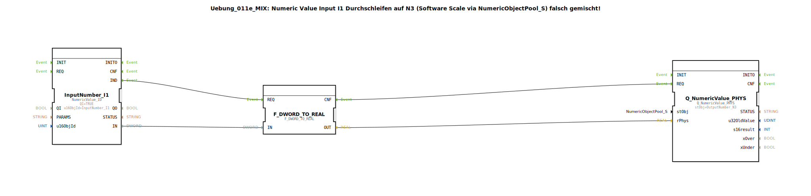

# Uebung_011e_MIX: Numeric Value Input I1 Durchschleifen auf N3 (Software Scale via NumericObjectPool_S) falsch gemischt!

* * * * * * * * * *

## Einleitung

Diese Übung demonstriert ein **inkompatibles Zusammenspiel** zweier verschiedener Namespaces im isobus-Kontext. Das Ziel ist es, einen numerischen Wert von einem Eingang (I1) auf einen Ausgang (N3) durchzuschleifen, wobei bewusst eine Software-Skalierung über den `NumericObjectPool_S` verwendet wird – jedoch mit **falsch gemischten** Typen. Die Übung verdeutlicht die Probleme, die durch die Verwendung unterschiedlicher Datenrepräsentationen (Raw-Werte vs. physikalische Werte) entstehen können.

Im konkreten Beispiel: Eine Eingabe von `10` am Eingang I1 wird über den Baustein `F_RAW_TO_PHYS(I1)` (hier durch `F_DWORD_TO_REAL` ersetzt) zu `10.0` umgewandelt und dann an den Ausgang `N3` übergeben. Allerdings sind die Namespaces der verwendeten Pool-Objekte (`InputNumber_I1` und `OutputNumber_N3`) inkompatibel, was zu unerwartetem Verhalten führt – die Übung zeigt diese Fallstricke auf.

## Verwendete Funktionsbausteine (FBs)

Die Übung besteht aus einer linearen Kette von drei Funktionsbausteinen (keine Sub-Bausteine):

| Bausteinname | Typ | Beschreibung |
|--------------|-----|--------------|
| `InputNumber_I1` | `isobus::UT::io::NumericValue::NumericValue_ID` | Liest einen numerischen Wert (DWORD) aus dem Pool `InputNumber_I1`. Der Parameter `u16ObjId` ist auf `"InputNumber_I1"` gesetzt, und der Qualifier `QI` ist `TRUE`. Der Ereignisausgang `IND` signalisiert einen neuen Wert am Eingang `IN`. |
| `F_DWORD_TO_REAL` | `iec61131::conversion::F_DWORD_TO_REAL` | Wandelt einen `DWORD`-Wert in einen `REAL`-Wert um (gemäß IEC 61131-3). Der Eingang `REQ` startet die Konvertierung, und nach Abschluss wird der Ausgang `CNF` getriggert. |
| `Q_NumericValue_PHYS` | `isobus::UT::Q::Q_NumericValue_PHYS` | Schreibt einen physikalischen `REAL`-Wert in das Ausgangsobjekt `OutputNumber_N3` (übernommen aus dem Pool `OutputNumber_N3`). Der Parameter `stObj` wird auf den entsprechenden String gesetzt. Der Baustein erwartet einen physikalischen Wert am Eingang `rPhys` und gibt diesen auf den Pool aus. |

## Programmablauf und Verbindungen

Der Ablauf ist ereignisgesteuert und erfolgt in drei Schritten:

1. **Eingabe lesen:**  
   Wenn `InputNumber_I1` einen neuen Wert erhält (z. B. `10`), sendet es ein Ereignis über `IND` an den Konvertierungsbaustein `F_DWORD_TO_REAL.REQ`. Gleichzeitig wird der gelesene DWORD-Wert über die Datenverbindung `InputNumber_I1.IN` → `F_DWORD_TO_REAL.IN` übergeben.

2. **Konvertierung:**  
   `F_DWORD_TO_REAL` wandelt den DWORD-Wert in einen REAL-Wert um (z. B. `10` → `10.0`). Nach Abschluss sendet es ein Ereignis über `CNF` an den Ausgangsbaustein `Q_NumericValue_PHYS.REQ`. Der konvertierte REAL-Wert wird über die Datenverbindung `F_DWORD_TO_REAL.OUT` → `Q_NumericValue_PHYS.rPhys` weitergegeben.

3. **Ausgabe schreiben:**  
   `Q_NumericValue_PHYS` empfängt das Ereignis und schreibt den physikalischen REAL-Wert in das Pool-Objekt `OutputNumber_N3`. Am Bedienpanel erscheint dann beispielsweise `10.00`.

**Besonderheit:**  
In der Kommentarspalte wird darauf hingewiesen, dass die beiden Namespaces (`isobus::UT::io::NumericValue::NumericValue_ID` und `isobus::UT::Q::Q_NumericValue_PHYS`) **inkompatibel** sind. Der eingehende Wert wird zwar korrekt durchgeschleift, aber die semantische Zuordnung (Raw vs. Physical) wird verletzt, was zu Fehlinterpretationen in der Visualisierung führen kann. Die Übung soll daher für solche Inkompatibilitäten sensibilisieren.

## Zusammenfassung

Die Übung `Uebung_011e_MIX` zeigt, wie ein numerischer Wert vom Eingang `I1` über eine einfache Konvertierung (`DWORD → REAL`) zum Ausgang `N3` übertragen wird. Sie demonstriert jedoch bewusst eine **falsche Mischung** von Namespaces, die im produktiven Einsatz zu unerwarteten Ergebnissen führt. Ziel ist es, die Bedeutung der korrekten Auswahl von Pool-Objekten und den Umgang mit physikalischen vs. Rohdaten verständlich zu machen. Die Übung eignet sich für Einsteiger in die isobus-Konfiguration mit 4diac, die die Unterschiede zwischen verschiedenen Datentypen und Pools kennenlernen möchten.