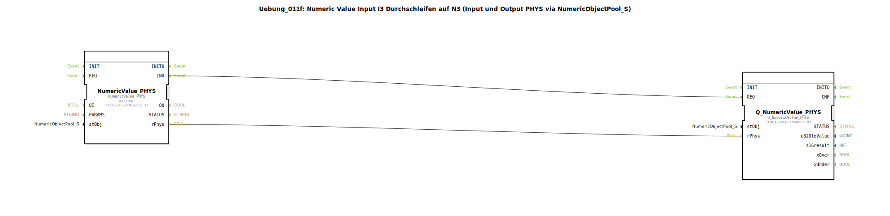

# Uebung_011f: Numeric Value Input I3 Durchschleifen auf N3 (Input und Output PHYS via NumericObjectPool_S)

* * * * * * * * * *
## Einleitung
Diese Übung demonstriert die direkte Durchschleifung eines numerischen Eingangswertes von der physikalischen Eingabe I3 zur physikalischen Ausgabe N3.  
Der Wert wird ohne Umrechnung oder Verarbeitung von einem `NumericValue_PHYS`-Baustein gelesen und über einen `Q_NumericValue_PHYS`-Baustein auf den Ausgang geschrieben.  
Die Verwendung eines `NumericObjectPool_S` (DefaultPool_Numeric) stellt die Verbindung zu den konkreten Ein‑/Ausgangsobjekten her.  
Beispiel:  
**I3-Eingabe -500.00 → rPhys = -500.0 → Q_NumericValue_PHYS(N3) → N3 zeigt -500.00**

## Verwendete Funktionsbausteine (FBs)
### Sub-Baustein: Uebung_011f (SubAppType)
- **Typ**: SubAppType (eigene Subapplikation)
- **Verwendete interne FBs**:
  - **NumericValue_PHYS** *(Typ: `isobus::UT::io::NumericValue::NumericValue_PHYS`)*  
    - Parameter:  
      - `QI` = `TRUE`  
      - `stObj` = `InputNumber_I3` (aus DefaultPool_Numeric)  
    - Ereignisausgang: `IND`  
    - Datenausgang: `rPhys` (Realwert)  
  - **Q_NumericValue_PHYS** *(Typ: `isobus::UT::Q::Q_NumericValue_PHYS`)*  
    - Parameter:  
      - `stObj` = `OutputNumber_N3` (aus DefaultPool_Numeric)  
    - Ereigniseingang: `REQ`  
    - Dateneingang: `rPhys` (Realwert)  
- **Funktionsweise**:  
  Der Baustein `NumericValue_PHYS` liest den aktuellen physikalischen Wert des Eingangs I3. Sobald ein neuer Wert verfügbar ist, wird dies über das Ereignis `IND` signalisiert und der Wert am Ausgang `rPhys` bereitgestellt.  
  Dieses Ereignis wird direkt mit dem Ereigniseingang `REQ` des Bausteins `Q_NumericValue_PHYS` verbunden. Gleichzeitig wird der Datenwert `rPhys` auf den entsprechenden Dateneingang des Ausgangsbausteins übertragen.  
  Der Baustein `Q_NumericValue_PHYS` schreibt daraufhin den empfangenen Wert auf das physikalische Ausgangsobjekt N3.  
  Die gesamte Subapplikation fungiert somit als eine transparente Durchschleifung von I3 nach N3.

## Programmablauf und Verbindungen
- **Ereignisverbindung**: `NumericValue_PHYS.IND` → `Q_NumericValue_PHYS.REQ`  
- **Datenverbindung**: `NumericValue_PHYS.rPhys` → `Q_NumericValue_PHYS.rPhys`  

Der Ablauf ist rein ereignisgesteuert:  
1. Der Eingangsbaustein erkennt eine Änderung an I3 und feuert `IND`.  
2. Der Ausgangsbaustein wird über `REQ` getriggert, den aktuellen `rPhys`‑Wert zu übernehmen und auf N3 auszugeben.  
3. Da keine weiteren Verarbeitungsschritte erfolgen, wird der Wert eins zu eins übertragen.  

**Lernziele**:  
- Verständnis der direkten Verknüpfung von physikalischen Ein‑/Ausgängen mittels `NumericValue_PHYS` und `Q_NumericValue_PHYS`.  
- Kennenlernen der ereignisgesteuerten Datenweitergabe (ohne zusätzliche Logik).  
- Anwendung des `NumericObjectPool_S` zur Konfiguration von I/O‑Objekten.  

**Schwierigkeitsgrad**: Einsteiger  
**Vorkenntnisse**: Grundlegende Kenntnisse der 4diac‑IDE und des IEC 61499‑Modells.

## Zusammenfassung
Die Übung **Uebung_011f** realisiert eine einfache Durchschleifung eines numerischen Werts vom Eingang I3 zum Ausgang N3.  
Durch die Kombination von `NumericValue_PHYS` (lesend) und `Q_NumericValue_PHYS` (schreibend) wird eine klare Trennung zwischen I/O‑Zugriff und Ereignissteuerung erreicht.  
Die Subapplikation ist als wiederverwendbarer Baustein konzipiert und kann direkt in größere Applikationen eingebunden werden.