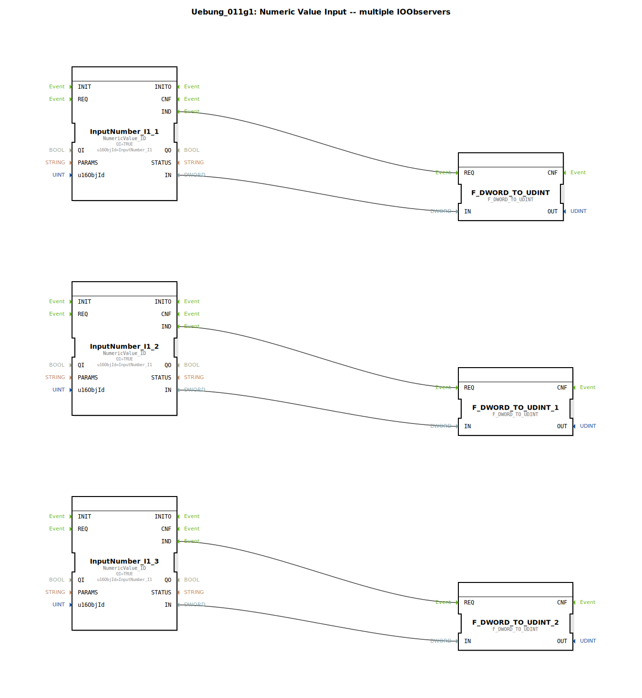

# Uebung_011g1: Numeric Value Input -- multiple IOObservers

* * * * * * * * * *

## Einleitung

Diese Übung demonstriert den parallelen Einsatz mehrerer `IOObserver` für einen gemeinsamen numerischen Eingangswert. Drei Instanzen des Funktionsbausteins `NumericValue_ID` überwachen denselben Objekt‑Identifikator (`InputNumber_I1`). Die gelieferten `DWORD`-Werte werden jeweils mit einem Konvertierungsbaustein in den Typ `UDINT` umgewandelt. Die Übung vermittelt, wie mehrere Observer auf eine gemeinsame Datenquelle geschaltet werden können, ohne dass die Werte sich gegenseitig beeinflussen.

## Verwendete Funktionsbausteine (FBs)

### Sub‑Bausteine: (keine – Hauptbaustein ist eine SubApp)

Die SubApp besteht direkt aus folgenden Funktionsbausteinen:

- **`NumericValue_ID`** (Typ: `isobus::UT::io::NumericValue::NumericValue_ID`)  
  - **Parametrierung**:  
    - `QI` = `TRUE` (Aktivierung)  
    - `u16ObjId` = `InputNumber_I1` (Identifikator der numerischen Eingabe)  
  - **Ereignisse**:  
    - Ereignisausgang `IND` – signalisiert, dass ein neuer Wert anliegt  
  - **Datenausgang**: `IN` (Typ `DWORD`) – aktueller Wert der beobachteten Objektinstanz

- **`F_DWORD_TO_UDINT`** (Typ: `iec61131::conversion::F_DWORD_TO_UDINT`)  
  - **Keine weiteren Parameter**  
  - **Ereigniseingang**: `REQ` – startet die Konvertierung  
  - **Dateneingang**: `IN` vom Typ `DWORD`  
  - **Datenausgang**: `OUT` vom Typ `UDINT` (unsigned double integer)  
  - **Funktion**: Wandelt einen 32‑Bit DWORD‑Wert in einen vorzeichenlosen 32‑Bit‑Integer um.

Im Netzwerk sind drei identische Paare dieser Bausteine vorhanden:

| Observer (NumericValue_ID) | Konverter (F_DWORD_TO_UDINT) |
|----------------------------|-------------------------------|
| `InputNumber_I1_1`         | `F_DWORD_TO_UDINT`            |
| `InputNumber_I1_2`         | `F_DWORD_TO_UDINT_1`          |
| `InputNumber_I1_3`         | `F_DWORD_TO_UDINT_2`          |

## Programmablauf und Verbindungen

1. **Ereignisverbindungen** (EventConnections):  
   Jeder Observer (`IND`) ist je mit dem Konverter (`REQ`) verbunden. Sobald ein neuer Wert vom ISOBUS‑Gateway eintrifft, wird genau der zugehörige Konvertierungsvorgang ausgelöst.

2. **Datenverbindungen** (DataConnections):  
   Der Datenausgang `IN` jedes Observers ist direkt mit dem Dateneingang `IN` des zugehörigen Konverters verbunden. Die drei Datenpfade sind vollständig voneinander isoliert; jeder Konverter arbeitet mit dem Wert des ihm zugeordneten Observers.

3. **Gemeinsame Quelle**:  
   Alle drei `NumericValue_ID`‑Bausteine beziehen ihre Daten vom selben ISOBUS‑Objekt (`InputNumber_I1`). Die Observer können unabhängig voneinander arbeiten, da jeder eine eigene Kopie des aktuellen Werts erhält.

4. **Konvertierung**:  
   Die Ausgänge `OUT` der drei `F_DWORD_TO_UDINT`‑Bausteine stellen das gleiche numerische Signal als `UDINT` dar – für unterschiedliche Verbraucher innerhalb der Anwendung.

### Lernziele

- Verständnis für die parallele Überwachung einer einzigen ISOBUS‑Variable mit mehreren `IOObserver`‑Instanzen.
- Anwendung von Typkonvertierungen (`DWORD` → `UDINT`) in 4diac.
- Fehlervermeidung durch getrennte Signalwege (kein Daten‑Overlap).

### Schwierigkeitsgrad

Einfach – grundlegende Funktionsbausteine und einfache Verdrahtung.  
Vorausgesetzt werden Basiskenntnisse in 4diac und im Umgang mit ISOBUS‑Datenobjekten.

## Zusammenfassung

Die Übung `Uebung_011g1` zeigt ein Muster, bei dem ein einzelner numerischer Eingang (`InputNumber_I1`) von drei unabhängigen Observer‑Bausteinen gelesen wird. Jeder Observer löst einen eigenen Konvertierungs‑FB (`DWORD` → `UDINT`) aus, sodass drei identische, aber isolierte Signalpfade entstehen. Dies ist nützlich, wenn der Wert an mehreren Stellen in der Steuerung benötigt wird und jede Stelle eine eigene, störungsfreie Datenkopie erfordert. Die einfache Struktur eignet sich hervorragend für Einstiegsübungen zur parallelen Datenverarbeitung mit 4diac.