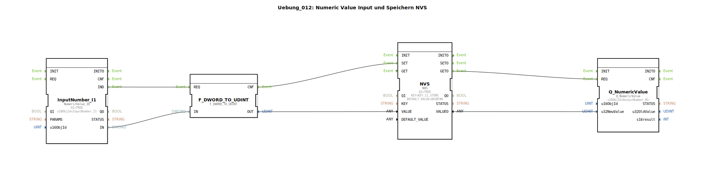

# Uebung_012: Numeric Value Input und Speichern NVS

Dieser Artikel beschreibt die logiBUS®-Übung `Uebung_012`. Hier wird gezeigt, wie numerische Werte nicht nur angezeigt, sondern auch stromausfallsicher in der Steuerung (NVS - Non Volatile Storage) gespeichert werden.

## 🎧 Podcast

* [Amazon Pizza-Regel bis IKEA-Effekt: 12 verblüffend einfache Ideen hinter riesigem Geschäftserfolg](https://podcasters.spotify.com/pod/show/ms-muc-lama/episodes/Amazon-Pizza-Regel-bis-IKEA-Effekt-12-verblffend-einfache-Ideen-hinter-riesigem-Geschftserfolg-e39kmmc)

----

## Ziel der Übung

Erlernen der persistenten Datenspeicherung. Es wird demonstriert, wie ein am Terminal eingegebener Wert im internen Flash-Speicher der Steuerung abgelegt und beim Neustart automatisch wieder geladen und angezeigt wird.

-----

## Beschreibung und Komponenten

[cite_start]Die Subapplikation `Uebung_012.SUB` verbindet Eingabe, Speicherung und Anzeige zu einem geschlossenen Kreislauf[cite: 1].

### Funktionsbausteine (FBs)

  * **`InputNumber_I1`**: Numerisches Eingabefeld am Terminal.
  * **`NVS`**: Typ `logiBUS::storage::esp32_nvs::NVS`. [cite_start]Dieser Baustein verwaltet den Zugriff auf den nicht-flüchtigen Speicher. Er speichert Werte unter einem eindeutigen `KEY` ab[cite: 1].
  * **`CbVtStatus`**: Ein Statusbaustein des Terminals. [cite_start]Er feuert ein Ereignis (`IND`), wenn das Terminal neu startet oder die Verbindung wiederhergestellt wird[cite: 1].
  * **`Q_NumericValue`**: Die numerische Anzeige am Terminal.

-----

## Funktionsweise

Der Prozess deckt drei Szenarien ab:

1.  **Speichern**: Gibt der Nutzer einen Wert ein (`IND`), wird dieser konvertiert und per `NVS.SET` dauerhaft gespeichert.
2.  **Laden beim Start**: Nach dem Booten sendet der Speicherbaustein ein `INITO`-Event, welches sofort einen Lese-Vorgang (`GET`) auslöst. Der gespeicherte Wert wird geladen und an die Anzeige gesendet.
3.  **Refresh bei Verbindung**: Falls das Terminal während des Betriebs kurzzeitig getrennt wird, sorgt `CbVtStatus.IND` dafür, dass der aktuelle Wert erneut an das Terminal gesendet wird, sobald es wieder online ist.

-----

## Anwendungsbeispiel

**Konfigurations-Parameter**:
Ein Landwirt stellt die Arbeitsbreite seines Gerätes einmalig am Terminal ein. Dank NVS-Speicherung muss er diesen Wert nicht bei jedem morgendlichen Start der Maschine neu eingeben; die Steuerung "erinnert" sich an die letzte Einstellung.