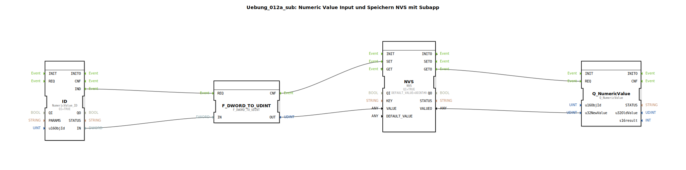

# Uebung_012a_sub: Numeric Value Input und Speichern NVS mit Subapp

## Übersicht

[cite_start]Dieser Baustein dient als universelle Schnittstelle für Benutzereingaben, die dauerhaft im NVS (Non Volatile Storage) gespeichert werden sollen[cite: 1].
Er bündelt folgende Funktionen:

1.  **Eingabe**: Einlesen eines Werts vom Terminal (`NumericValue_ID`).
2.  **Speichern**: Automatisches Ablegen im Flash-Speicher unter einem wählbaren Schlüssel (`KEY`).
3.  **Laden**: Automatisches Auslesen des Werts beim Systemstart (`INITO -> GET`).
4.  **Rückmeldung**: Senden des (geladenen oder geänderten) Werts an die Anzeige am Terminal.
Zusätzlich bietet der Baustein einen Eingang `REQ`, um den Anzeige-Refresh extern (z.B. bei Terminal-Neuverbindung) anzustoßen.

## 🛠️ Zugehörige Übungen

* [Uebung_012a](Uebung_012a.md)

