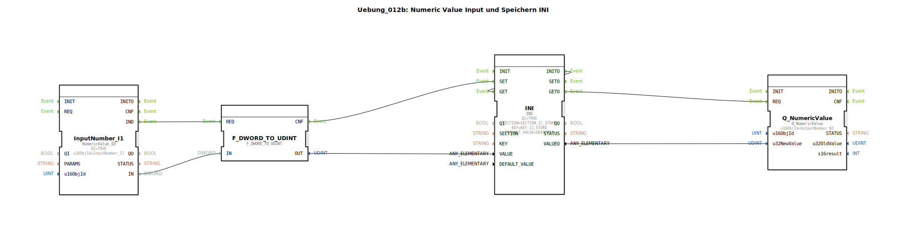

# Uebung_012b: Numeric Value Input und Speichern INI

Dieser Artikel beschreibt die logiBUS®-Übung `Uebung_012b`. Hier wird eine alternative Methode zur Speicherung von Daten vorgestellt: Die Verwendung von INI-Dateien.

----

## Ziel der Übung

Verwendung des `INI` Bausteins zur strukturierten Datenspeicherung. Im Gegensatz zum einfachen NVS-Key-Value-Speicher erlaubt das INI-Format eine Gliederung in Sektionen und Schlüssel, was bei großen Datenmengen übersichtlicher ist.

-----

## Beschreibung und Komponenten

[cite_start]Die Subapplikation `Uebung_012b.SUB` nutzt einen INI-Speicher-Baustein[cite: 1].

### Funktionsbausteine (FBs)

  * **`INI`**: Typ `eclipse4diac::storage::INI`. [cite_start]Dieser Baustein speichert Werte in einer dateibasierten Struktur ab[cite: 1]. Er benötigt zusätzlich zum `KEY` eine `SECTION`.
  * **Parameter**:
    * `SECTION`: "SECTION_I1_STORE"
    * `KEY`: "KEY_I1_STORE"
    * `DEFAULT_VALUE`: 55 (wird geladen, falls noch keine Datei existiert).

-----

## Funktionsweise

Die Logik entspricht ansonsten der Übung 012:
1.  **Schreiben**: `InputNumber -> REQ -> INI.SET`.
2.  **Lesen**: `INITO -> INI.GET -> Q_NumericValue`.
3.  **Refresh**: `CbVtStatus -> Q_NumericValue`.

INI-Dateien sind besonders nützlich, wenn Parameter extern (z.B. über einen PC oder Web-Interface) ausgelesen oder editiert werden sollen, da sie in einem für Menschen lesbaren Textformat vorliegen.