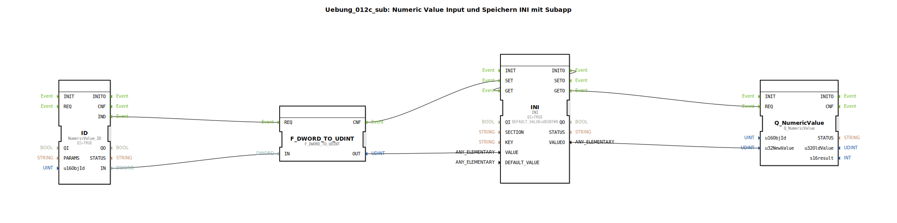

# Uebung_012c_sub: Numeric Value Input und Speichern INI mit Subapp




* * * * * * * * * *

## Einleitung

Diese Übung zeigt, wie ein numerischer Wert über eine Objekt-ID (z. B. von einem CAN‑Bus) eingelesen, in einen `UDINT` konvertiert und mithilfe einer INI‑Speicherfunktion dauerhaft abgelegt wird. Der gespeicherte Wert kann anschließend über einen `Q_NumericValue`‑Baustein ausgegeben werden. Die SubApp stellt die Schnittstellen `KEY`, `SECTION`, `u16ObjId` (Eingänge) sowie `VALUEO` (Ausgang) und das Ereignis `IND` zur Verfügung.

Der Baustein wird typischerweise verwendet, um Konfigurationsdaten oder gemessene Werte persistent zu halten und zyklisch zu aktualisieren.

## Verwendete Funktionsbausteine (FBs)

### FB: ID (isobus::UT::io::NumericValue::NumericValue_ID)
- **Parameter**: `QI` = `TRUE`
- **Ereignisse**:
  - Ereigniseingänge: keine sichtbaren
  - Ereignisausgänge: `IND` (wird ausgelöst, wenn ein neuer Wert empfangen wurde)
- **Dateneingänge**: `u16ObjId` (vom SubApp‑Eingang `u16ObjId`)
- **Datenausgänge**: `IN` (der empfangene numerische Wert als DWORD)
- **Funktionsweise**: Liest einen numerischen Wert von einer bestimmten Objekt‑ID (z. B. aus einem ISOBUS‑Netzwerk). Bei erfolgreichem Empfang wird das Ereignis `IND` gesendet und der Wert an `IN` ausgegeben.

### FB: F_DWORD_TO_UDINT (iec61131::conversion::F_DWORD_TO_UDINT)
- **Parameter**: keine
- **Ereignisse**:
  - Ereigniseingänge: `REQ`
  - Ereignisausgänge: `CNF`
- **Dateneingänge**: `IN` (DWORD)
- **Datenausgänge**: `OUT` (UDINT)
- **Funktionsweise**: Konvertiert einen DWORD-Wert in einen UDINT-Wert. Der konvertierte Wert wird nach Abschluss der Konvertierung am Ausgang `OUT` bereitgestellt.

### FB: INI (eclipse4diac::storage::INI)
- **Parameter**: `QI` = `TRUE`, `DEFAULT_VALUE` = `UDINT#0`
- **Ereignisse**:
  - Ereigniseingänge: `SET`, `GET`, `INI`
  - Ereignisausgänge: `SETO`, `GETO`, `INITO`
- **Dateneingänge**: `KEY` (STRING), `SECTION` (STRING), `VALUE` (UDINT)
- **Datenausgänge**: `VALUEO` (UDINT)
- **Funktionsweise**: Speichert einen Wert unter einem Schlüssel (`KEY`) in einer Sektion (`SECTION`) in einer INI‑artigen Struktur. Wird `SET` getriggert, wird der aktuelle `VALUE` gespeichert und `SETO` ausgelöst. Wird `GET` getriggert, wird der gespeicherte Wert gelesen und an `VALUEO` ausgegeben sowie `GETO` gesendet. Beim Initialisieren (Ereignis `INI`) wird der Wert aus dem Speicher geladen oder der `DEFAULT_VALUE` verwendet.

### FB: Q_NumericValue (isobus::UT::Q::Q_NumericValue)
- **Parameter**: keine
- **Ereignisse**:
  - Ereigniseingänge: `REQ`
  - Ereignisausgänge: keine im SubApp sichtbaren
- **Dateneingänge**: `u16ObjId` (UINT), `u32NewValue` (UDINT)
- **Datenausgänge**: keine sichtbaren (dient der internen Verarbeitung / Ausgabe an ein übergeordnetes System)
- **Funktionsweise**: Nimmt einen neuen Wert (`u32NewValue`) für eine bestimmte Objekt‑ID (`u16ObjId`) entgegen und signalisiert diesen z. B. an eine übergeordnete Steuerung oder Visualisierung. Die interne Verarbeitung erfolgt beim Empfang des Ereignisses `REQ`.

## Programmablauf und Verbindungen

Die SubApp arbeitet in mehreren Schritten, die über Ereignis- und Datenverbindungen miteinander verknüpft sind.

1. **Wert einlesen und konvertieren**  
   - Der Baustein `ID` wartet auf einen neuen Wert zur Objekt‑ID `u16ObjId`. Sobald ein Wert eintrifft, sendet er das Ereignis `IND`.
   - Dieses Ereignis wird an den Konvertierungsbaustein `F_DWORD_TO_UDINT.REQ` weitergeleitet.
   - Gleichzeitig wird der gelesene DWORD‑Wert von `ID.IN` an `F_DWORD_TO_UDINT.IN` übergeben.
   - Nach erfolgreicher Konvertierung sendet `F_DWORD_TO_UDINT` das Ereignis `CNF` und der konvertierte UDINT‑Wert erscheint an `OUT`.

2. **Wert speichern**  
   - Das Ereignis `F_DWORD_TO_UDINT.CNF` triggert den `INI.SET`‑Eingang.
   - Der konvertierte Wert wird über die Datenverbindung von `F_DWORD_TO_UDINT.OUT` an `INI.VALUE` übergeben.
   - Der Schlüssel (`KEY`) und die Sektion (`SECTION`) werden von den SubApp‑Eingängen direkt an den INI‑Baustein geführt.
   - Nach dem Speichern sendet `INI` das Ereignis `SETO`, welches an den SubApp‑Ausgang `IND` weitergeleitet wird (dort als sichtbarer Ausgang der SubApp).

3. **Gespeicherten Wert ausgeben / aktualisieren**  
   - Bei der Initialisierung der SubApp (implizit oder durch ein externes Initialisierungsereignis) wird `INI.INITO` ausgelöst und direkt mit `INI.GET` verbunden (siehe Event‑Connection `INI.INITO -> INI.GET`). Dadurch wird der zuletzt gespeicherte Wert gelesen.
   - Der gelesene Wert erscheint an `INI.VALUEO`.
   - Das Ereignis `GETO` wird gleichzeitig an zwei Stellen weitergegeben:
     - An den Baustein `Q_NumericValue.REQ`, der den Wert (`INI.VALUEO` → `Q_NumericValue.u32NewValue`) übernimmt.
     - An den SubApp‑Ausgang `IND` (unsichtbare Verbindung), sodass die übergeordnete Applikation über die Aktualisierung informiert wird.
   - Die Objekt‑ID für `Q_NumericValue` stammt vom SubApp‑Eingang `u16ObjId`.

4. **Ausgang der SubApp**  
   - Der gespeicherte Wert `VALUEO` wird parallel zum SubApp‑Ausgang `VALUEO` durchgeschleift.

Die folgende Grafik (schematisch) zeigt die wesentlichen Verbindungen:

```
u16ObjId ──┬──> ID.u16ObjId
           └──> Q_NumericValue.u16ObjId

ID.IND ───> F_DWORD_TO_UDINT.REQ
ID.IN  ───> F_DWORD_TO_UDINT.IN
F_DWORD_TO_UDINT.CNF ───> INI.SET
F_DWORD_TO_UDINT.OUT ───> INI.VALUE
KEY ───> INI.KEY
SECTION ───> INI.SECTION
INI.SETO ───> IND (SubApp Ausgang)
INI.VALUEO ───> Q_NumericValue.u32NewValue
INI.VALUEO ───> VALUEO (SubApp Ausgang)
INI.GETO ───> Q_NumericValue.REQ
INI.GETO ───> IND (SubApp Ausgang)
INI.INITO ───> INI.GET (intern)
```

## Zusammenfassung

In dieser Übung wurde eine SubApp realisiert, die einen numerischen Wert über eine Objekt‑ID einliest, in einen `UDINT` konvertiert, in einer INI‑ähnlichen Speicherstruktur ablegt und den gespeicherten Wert wieder ausgibt. Dabei kamen folgende Konzepte zum Einsatz:

- **NumericValue_ID** zum Lesen eines Werts aus einem Feldbus oder Netzwerk.
- **F_DWORD_TO_UDINT** zur Datentyp‑Konvertierung.
- **INI**‑Baustein zur persistenten Speicherung mit Schlüssel/Sektion.
- **Q_NumericValue** zur Weiterverarbeitung des gespeicherten Werts.

Die SubApp demonstriert die typische Vorgehensweise für eine zyklische Datenaufnahme und ‑speicherung in der Automatisierungstechnik. Sie kann als Grundlage für komplexere Anwendungen wie das Speichern von Parametern oder das Loggen von Messwerten dienen.