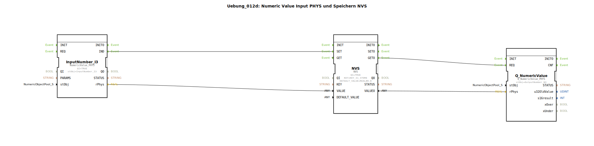

# Uebung_012d: Numeric Value Input PHYS und Speichern NVS

* * * * * * * * * *
## Einleitung

Diese Übung demonstriert die Erfassung eines numerischen Werts (Physical Value) über einen Eingabebaustein, das Speichern des Werts im nichtflüchtigen Speicher (NVS) sowie das Auslesen und Bereitstellen des gespeicherten Werts über einen Ausgabebaustein. Ziel ist es, den Ablauf von Datenerfassung, persistenter Speicherung und Rückgabe zu verstehen.

## Verwendete Funktionsbausteine (FBs)

Die Übung verwendet drei Funktionsbausteine, die innerhalb der Subapplikation vernetzt sind:

1. **InputNumber_I3** – Typ: `isobus::UT::io::NumericValue::NumericValue_PHYS`
   - Parameter:
     - `QI` = `TRUE`
     - `stObj` = `InputNumber_I3`
   - Funktion: Stellt die physikalische Eingabe eines numerischen Werts bereit. Der Wert wird über den Datenausgang `rPhys` ausgegeben, sobald ein Ereignis am Eingang `IND` anliegt.

2. **NVS** – Typ: `logiBUS::storage::esp32_nvs::NVS`
   - Parameter:
     - `QI` = `TRUE`
     - `KEY` = `KEY_I1_STORE` (importiert aus `Uebungen::const::NVS::NVS_Keys`)
     - `DEFAULT_VALUE` = `REAL#0.0`
   - Funktion: Nichtflüchtiger Speicherbaustein. Er speichert einen Wert unter einem vorgegebenen Schlüssel (`KEY`) und kann diesen bei Bedarf wieder auslesen. Die Ereignisse `SET` und `GET` steuern das Speichern bzw. Lesen. Die Ausgänge `VALUEO` liefern den gespeicherten Wert.

3. **Q_NumericValue** – Typ: `isobus::UT::Q::Q_NumericValue_PHYS`
   - Parameter:
     - `stObj` = `OutputNumber_N3`
   - Funktion: Stellt einen numerischen Wert als physikalischen Ausgang bereit. Der Wert wird über den Dateneingang `rPhys` entgegengenommen und bei einem Ereignis am Eingang `REQ` ausgegeben.

### Sub-Bausteine

Die Übung selbst ist als SubAppType definiert und enthält keine weiteren Sub-Bausteine. Die drei oben genannten FBs sind direkt im Netzwerk verbunden.

## Programmablauf und Verbindungen

Der Ablauf ist wie folgt:

1. **Eingabe und Speichern**  
   - Wenn ein neuer physikalischer Wert an `InputNumber_I3` anliegt, erzeugt dieser ein Ereignis am Ausgang `IND`.  
   - Dieses Ereignis wird über eine Eventverbindung an den Eingang `SET` des NVS-Bausteins weitergeleitet.  
   - Gleichzeitig wird der Datenwert von `InputNumber_I3.rPhys` über eine Datenverbindung an den NVS-Dateneingang `VALUE` übergeben.  
   - Der NVS speichert den Wert unter dem Schlüssel `KEY_I1_STORE` im nichtflüchtigen Speicher.

2. **Initialisieren und Auslesen**  
   - Nach dem Start (oder nach einer Initialisierung) erzeugt der NVS-Baustein ein Ereignis am Ausgang `INITO`.  
   - Dieses Ereignis wird über eine Eventverbindung an den Eingang `GET` des NVS zurückgeführt (Selbsttriggerung).  
   - Der NVS liest daraufhin den gespeicherten Wert aus und legt ihn am Datenausgang `VALUEO` an.  
   - Gleichzeitig wird ein Ereignis am Ausgang `GETO` erzeugt.

3. **Ausgabe**  
   - Das Ereignis `NVS.GETO` wird an den Eingang `REQ` des Ausgabebausteins `Q_NumericValue` weitergeleitet.  
   - Der Datenwert `NVS.VALUEO` wird über eine Datenverbindung an den Eingang `Q_NumericValue.rPhys` übergeben.  
   - `Q_NumericValue` stellt den Wert daraufhin am physikalischen Ausgang `OutputNumber_N3` bereit.

Zusammengefasst: Jeder eingehende Wert wird sofort gespeichert, und beim Systemstart wird der zuletzt gespeicherte Wert automatisch ausgegeben. Die Übung eignet sich für Einsteiger, die das Zusammenspiel von Ein-/Ausgabebausteinen mit einem nichtflüchtigen Speicher kennenlernen möchten.

## Zusammenfassung

Die Übung `Uebung_012d` implementiert eine robuste Speicher- und Wiederherstellungsfunktion für einen physikalischen Zahlenwert. Durch die Kopplung eines Eingabebausteins (`NumericValue_PHYS`) mit einem NVS-Baustein und einem Ausgabebaustein (`Q_NumericValue_PHYS`) wird sichergestellt, dass der letzte Wert auch nach einem Neustart verfügbar bleibt. Der Ablauf ist einfach und nachvollziehbar: Wert erfassen → speichern → initial auslesen → ausgeben.