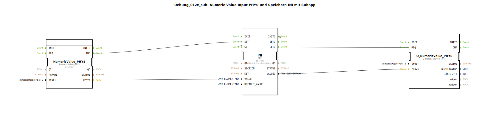

# Uebung_012e_sub: Numeric Value Input PHYS und Speichern INI mit Subapp

* * * * * * * * * *

## Einleitung

Diese Übung zeigt, wie ein physikalischer numerischer Wert (Numeric Value) über einen Funktionsbaustein eingelesen, in einer INI-Datei gespeichert und über einen Qualitätsbaustein (Q) verarbeitet wird. Die gesamte Funktionalität ist in einer SubApp gekapselt (SubAppType `Uebung_012e_sub`). Die SubApp verfügt über die Eingänge `KEY`, `SECTION` und `stObj` sowie den Ausgang `VALUEO`. Über ein Ereignis `IND` wird der erfolgreiche Abschluss signalisiert.

## Verwendete Funktionsbausteine (FBs)

Die SubApp enthält drei vordefinierte Funktionsbausteine:

- **NumeriValue_PHYS** (`isobus::UT::io::NumericValue::NumericValue_PHYS`)
    - Parameter: `QI = TRUE` (aktiviert)
    - Aufgabe: Liest einen physikalischen numerischen Wert basierend auf dem Objektpool (`stObj`) ein und gibt das Ergebnis als `rPhys` (REAL) aus.

- **INI** (`eclipse4diac::storage::INI`)
    - Parameter: `QI = TRUE`, `DEFAULT_VALUE = REAL#0.0`
    - Aufgabe: Speichert oder ruft Werte aus einer INI-Datei ab. Der Schreibvorgang wird über das Ereignis `SET` ausgelöst, das Lesen über `GET`. Bei Initialisierung (`INIT`) wird automatisch der vorhandene Wert aus der INI gelesen.

- **Q_NumericValue_PHYS** (`isobus::UT::Q::Q_NumericValue_PHYS`)
    - Parameter: keine speziellen Parameter
    - Aufgabe: Führt eine Qualitätsbewertung des numerischen Werts durch (z. B. Prüfung auf Gültigkeit oder Wertebereich). Erhält den Eingangswert über `rPhys` und konfiguriert via `stObj`.

## Programmablauf und Verbindungen

### Ereignisverbindungen

1. **Eingelesener Wert auslösen**  
   Wenn der FB `NumeriValue_PHYS` einen neuen physikalischen Wert bereitstellt, sendet er das Ereignis `IND`. Dieses wird mit dem `SET`-Ereignis des `INI`-Bausteins verbunden. Dadurch wird der aktuelle Wert (`rPhys`) in der INI-Datei unter dem angegebenen `KEY` und `SECTION` gespeichert.

2. **Rückmeldung nach Speichern**  
   Nach dem Speichern signalisiert `INI` mit `SETO`, dass der Vorgang abgeschlossen ist. Dieses Ereignis wird direkt an den Ausgang `IND` der SubApp weitergeleitet (mit der Eigenschaft `Visible=false`, d. h. im Diagramm ausgeblendet).

3. **Wert aus INI lesen und qualitativ prüfen**  
   Nach dem Speichern (oder nach einer Initialisierung) wird das Ereignis `GETO` des `INI`-Bausteins ausgelöst. Es ist mit dem `REQ`-Ereignis des `Q_NumericValue_PHYS`-Bausteins verbunden. Dadurch wird der gespeicherte Wert aus der INI gelesen und einer Qualitätsprüfung unterzogen.  
   Zusätzlich wird `GETO` auch noch einmal an den Ausgang `IND` weitergeleitet, sodass die SubApp auch nach dem Lesevorgang ein Signal abgibt.

4. **Initialisierung**  
   Der `INI`-Baustein hat außerdem sein eigenes `INIT`-Ereignis, das direkt mit dem `GET`-Ereignis verbunden ist. Dadurch wird beim Start der SubApp automatisch der in der INI gespeicherte Wert gelesen und anschließend durch den `GETO`-Fluss der Qualitätsbaustein durchlaufen.

### Datenverbindungen

- Der physikalische Wert (`rPhys`) von `NumeriValue_PHYS` wird an den Dateneingang `VALUE` des `INI`-Bausteins übergeben.
- Das Objektpool-Struktur-Objekt (`stObj`) wird von der SubApp-Schnittstelle an `NumeriValue_PHYS` und an `Q_NumericValue_PHYS` weitergegeben.
- Die Eingänge `KEY` und `SECTION` der SubApp sind direkt mit den entsprechenden Eingängen des `INI`-Bausteins verbunden (beide ausgeblendet im Diagramm).
- Der Ausgang `VALUEO` der SubApp erhält seinen Wert aus dem qualitätsgeprüften Ergebnis des `Q_NumericValue_PHYS`-Bausteins (über `VALUEO` von `INI` geleitet -> `rPhys` an `Q_NumericValue_PHYS`).

## Zusammenfassung

Die SubApp `Uebung_012e_sub` demonstriert den vollständigen Ablauf:

- **Einlesen** eines physikalischen numerischen Werts über `NumeriValue_PHYS`,
- **Speichern** dieses Werts in einer INI-Datei mittels `INI`,
- **Rücklesen** und **Qualitätsprüfung** des gespeicherten Werts mit `Q_NumericValue_PHYS`.

Sie ist als wiederverwendbarer Baustein konzipiert, der über die Parameter `KEY`, `SECTION` und `stObj` konfiguriert wird und den verarbeiteten Wert am Ausgang `VALUEO` bereitstellt sowie über das Ereignis `IND` quittiert.