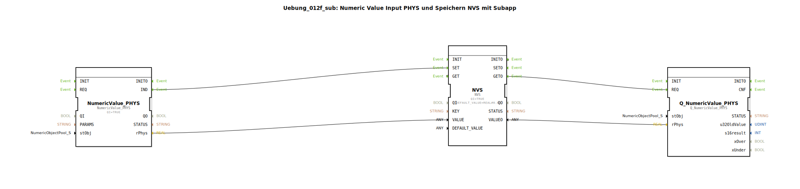

# Uebung_012f_sub: Numeric Value Input PHYS und Speichern NVS mit Subapp




* * * * * * * * * *
## Einleitung
Diese Übung demonstriert die Verarbeitung eines numerischen Eingangswertes (Rohwert) in einen physikalischen Wert, dessen dauerhafte Speicherung im nichtflüchtigen Speicher (NVS) sowie das anschließende Auslesen und die Ausgabe des gespeicherten Wertes. Die Funktionalität ist in einer Subapplikation (SubApp) gekapselt.

## Verwendete Funktionsbausteine (FBs)
Die Subapplikation besteht aus drei internen Funktionsbausteinen, die zusammen die gewünschte Funktionalität realisieren.

### Sub-Bausteine: Uebung_012f_sub (SubAppType)
- **Typ**: SubAppType
- **Verwendete interne FBs**:
    - **NumericValue_PHYS**: `isobus::UT::io::NumericValue::NumericValue_PHYS`
        - Parameter: `QI` = `TRUE`
        - Ereigniseingang: (keiner)
        - Ereignisausgang: `IND`
        - Dateneingang: `stObj` (Typ `NumericObjectPool_S`)
        - Datenausgang: `rPhys` (Typ `REAL`)
        - **Funktionsweise**: Wandelt einen über `stObj` definierten numerischen Rohwert in einen physikalischen Wert (`rPhys`) um. Bei erfolgreicher Umwandlung wird das Ereignis `IND` ausgelöst.

    - **NVS**: `logiBUS::storage::esp32_nvs::NVS`
        - Parameter: `QI` = `TRUE`, `DEFAULT_VALUE` = `REAL#0.0`
        - Ereigniseingänge: `SET`, `GET`, `INIT`
        - Ereignisausgänge: `SETO`, `GETO`, `INITO`
        - Dateneingänge: `VALUE` (Typ `REAL`), `KEY` (Typ `STRING`)
        - Datenausgang: `VALUEO` (Typ `REAL`)
        - **Funktionsweise**: Dient dem Speichern und Auslesen eines Wertes im nichtflüchtigen Speicher (ESP32 NVS). Der Wert wird unter einem Schlüssel (`KEY`) gespeichert. Bei `SET` wird der an `VALUE` anliegende Wert gespeichert, bei `GET` wird der gespeicherte Wert an `VALUEO` ausgegeben. Der Baustein initialisiert sich beim Start automatisch (Ereignis `INITO`).

    - **Q_NumericValue_PHYS**: `isobus::UT::Q::Q_NumericValue_PHYS`
        - Parameter: keine
        - Ereigniseingang: `REQ`
        - Ereignisausgang: (nicht verbunden)
        - Dateneingänge: `stObj` (Typ `NumericObjectPool_S`), `rPhys` (Typ `REAL`)
        - Datenausgang: (nicht verbunden)
        - **Funktionsweise**: Dieser Qualitätsbaustein prüft die Konsistenz zwischen dem Objekt-Pool (`stObj`) und dem physikalischen Wert (`rPhys`). Im vorliegenden Netzwerk wird er durch das Auslesen des NVS getriggert, um die Qualität des gelesenen Wertes zu überprüfen. Sein Ausgang wird nicht weiterverwendet (nur zur Überwachung).

## Programmablauf und Verbindungen
### Ereignisablauf
1. **Umwandlung und Speichern**:
   - Der Baustein `NumericValue_PHYS` erhält die Konfiguration (`stObj`) und den Rohwert (implizit über die Eingangsdaten der Subapp). Nach erfolgter Umwandlung erzeugt er das Ereignis `IND`.
   - Dieses Ereignis wird an den Eingang `SET` des NVS-Bausteins weitergeleitet. Gleichzeitig steht der physikalische Wert (`NumericValue_PHYS.rPhys`) am Dateneingang `NVS.VALUE` an.
   - Der NVS speichert den Wert unter dem Schlüssel, der dem Subapp-Eingang `KEY` entnommen wird, und quittiert mit `SETO`.
   - Das Ereignis `SETO` wird an den Subapp-Ausgang `IND` weitergegeben (dient als Bestätigung für den Aufrufer).

2. **Initialisierung und erstes Auslesen**:
   - Nach dem Start der Subapp wird das Ereignis `NVS.INITO` aktiviert (durch die Initialisierung des NVS-Bausteins).
   - Dieses Ereignis wird auf den Eingang `GET` des NVS gelegt. Dadurch wird sofort der gespeicherte Wert ausgelesen.
   - Der ausgelesene Wert erscheint am Datenausgang `NVS.VALUEO`.
   - Das Ereignis `GETO` wird gleichzeitig an zwei Ziele weitergeleitet:
     - An den Qualitätsbaustein `Q_NumericValue_PHYS.REQ`, der die Daten auf Plausibilität prüft (ohne Rückmeldung).
     - An den Subapp-Ausgang `IND` (erneute Bestätigung).
   - Der ausgelesene Wert (`NVS.VALUEO`) wird direkt an den Subapp-Datenausgang `VALUEO` weitergegeben sowie an den Dateneingang `Q_NumericValue_PHYS.rPhys`.

### Datenverbindungen
- `stObj` (Subapp-Eingang) → `NumericValue_PHYS.stObj` und `Q_NumericValue_PHYS.stObj`
- `KEY` (Subapp-Eingang) → `NVS.KEY`
- `NumericValue_PHYS.rPhys` → `NVS.VALUE`
- `NVS.VALUEO` → `VALUEO` (Subapp-Ausgang) und `Q_NumericValue_PHYS.rPhys`

### Übersicht der Verbindungen (grafisch nicht dargestellt)
```
[Subapp Eingänge] → [NumericValue_PHYS] → [NVS] → [Subapp Ausgänge]
                                  ↑          ↑
                                  +-- stObj  +-- KEY
                                  +-- Q_NumericValue_PHYS (Qualitätskontrolle)
```

### Lernziele
- Verständnis der Verwendung von nichtflüchtigen Speicherbausteinen (NVS) in 4diac.
- Kennenlernen der physikalischen Werteumrechnung mit `NumericValue_PHYS`.
- Einbindung eines Qualitätsbausteins zur Überwachung.
- Aufbau einer SubApp mit mehreren Funktionsbausteinen und Ereignis-/Datenverknüpfungen.

### Schwierigkeitsgrad: Mittel
### Vorkenntnisse
- Grundlegende Bedienung der 4diac-IDE.
- Verständnis von Ereignis- und Datenflüssen in IEC 61499.
- Kenntnis der verwendeten Bibliotheken (`isobus`, `logiBUS`).

## Zusammenfassung
Die Subapp `Uebung_012f_sub` realisiert eine kompakte Einheit zum Einlesen, Umrechnen, Speichern und Auslesen eines numerischen Wertes im nichtflüchtigen Speicher. Sie kombiniert die physikalische Konvertierung mit einer dauerhaften Speicherung und einer optionalen Qualitätsprüfung. Die Übung vermittelt praxisnahe Konzepte der industriellen Automatisierung mit 4diac.