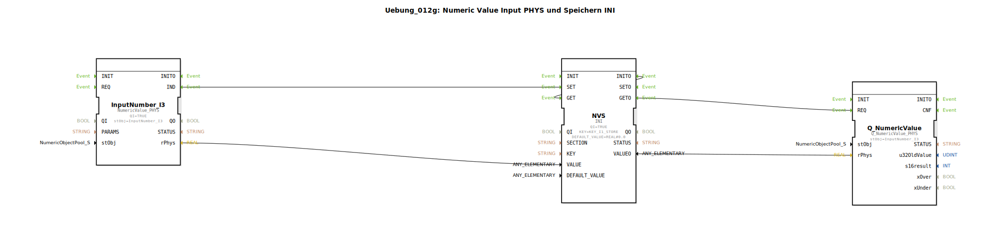

# Uebung_012g: Numeric Value Input PHYS und Speichern INI

* * * * * * * * * *
## Einleitung

Diese Übung veranschaulicht die Verwendung eines physischen numerischen Eingangs (`NumericValue_PHYS`) in Verbindung mit einer persistenten Speicherung über das INI-Dateiformat. Ziel ist es, einen eingegebenen numerischen Wert (z. B. von einem Sensor oder einer Benutzereingabe) einmalig zu speichern und bei Bedarf wieder auszulesen. Die Übung vermittelt grundlegende Konzepte der Ereignissteuerung, Datenflussverkettung und nichtflüchtigen Datenspeicherung in 4diac.

Die verwendeten Bausteine stammen aus den Bibliotheken `isobus::UT` und `eclipse4diac::storage`.

## Verwendete Funktionsbausteine (FBs)

### `InputNumber_I3`
- **Typ**: `isobus::UT::io::NumericValue::NumericValue_PHYS`
- **Parameter**:
    - `QI` = `TRUE`
    - `stObj` = `InputNumber_I3`
- **Funktionsweise**:  
  Dieser Baustein repräsentiert einen physischen numerischen Eingang (z. B. ein Analog‑ oder Digitaleingang). Bei einer Wertänderung am Eingang wird ein Ereignis `IND` ausgelöst und der aktuelle Wert als Gleitkommazahl am Ausgang `rPhys` bereitgestellt.

### `NVS`
- **Typ**: `eclipse4diac::storage::INI`
- **Parameter**:
    - `QI` = `TRUE`
    - `KEY` = `KEY_I1_STORE`
    - `DEFAULT_VALUE` = `REAL#0.0`
- **Funktionsweise**:  
  Der Baustein realisiert eine nichtflüchtige Speicherung mittels INI‑Datei. Mit dem Schlüssel `KEY_I1_STORE` kann ein Wert gespeichert und abgerufen werden.  
  - Beim Ereignis `INIT` sendet er `INITO` und führt anschließend automatisch `GET` aus.  
  - Bei `SET` wird der an `VALUE` anliegende Datenwert persistent gespeichert.  
  - Bei `GET` wird der gespeicherte Wert am Ausgang `VALUEO` ausgegeben (falls kein Wert gespeichert ist, wird `DEFAULT_VALUE` verwendet).

### `Q_NumericValue`
- **Typ**: `isobus::UT::Q::Q_NumericValue_PHYS`
- **Parameter**:
    - `stObj` = `InputNumber_I3`
- **Funktionsweise**:  
  Dieser Baustein stellt einen physischen Ausgang für numerische Werte dar. Durch die Ereignissanforderung `REQ` wird der an `rPhys` anliegende Wert an den physischen Ausgang weitergegeben.

## Programmablauf und Verbindungen

1. **Initialisierung**  
   Beim Start der Subapplikation wird der Baustein `NVS` mit `INIT` initialisiert und sendet `INITO`. Dieses Ereignis löst unmittelbar einen `GET`‑Befehl aus, um den zuletzt gespeicherten Wert zu laden. Der ausgelesene Wert gelangt über die Datenverbindung `NVS.VALUEO → Q_NumericValue.rPhys` an den Ausgangsbaustein.

2. **Eingabe eines neuen Wertes**  
   Sobald der Eingangsbaustein `InputNumber_I3` einen neuen numerischen Wert erfasst (Ereignis `IND`), wird dieser Wert über die Datenleitung `InputNumber_I3.rPhys → NVS.VALUE` an den Speicherbaustein übertragen. Gleichzeitig wird durch `IND` das Ereignis `SET` am Baustein `NVS` ausgelöst, wodurch der neue Wert persistent gespeichert wird.

3. **Ausgabe des gespeicherten Wertes**  
   Nach dem Speichervorgang (ausgelöst durch `SET`) führt `NVS` intern einen `GET` durch. Das Ereignis `GETO` wird erzeugt und an `Q_NumericValue.REQ` weitergeleitet.  
   Der zuvor gespeicherte Wert (nun von `NVS.VALUEO` bereitgestellt) wird an den Ausgangsbaustein übergeben und dort physisch ausgegeben.

## Zusammenfassung

Die Übung demonstriert eine vollständige Signalverarbeitungskette:
- Erfassen eines numerischen Werts über einen physischen Eingang,
- persistentes Speichern in einer INI‑Datei,
- erneutes Ausgeben des gespeicherten Werts an einen physischen Ausgang.

Durch die Ereignis‑ und Datenverbindungen wird sichergestellt, dass nach dem Einschalten automatisch der letzte gespeicherte Wert angezeigt wird und neue Eingabewerte sofort gespeichert und ausgegeben werden. Dieses Muster eignet sich für Anwendungen wie das Speichern von Sollwerten oder Konfigurationsparametern mit einfacher persistenter Datenhaltung.