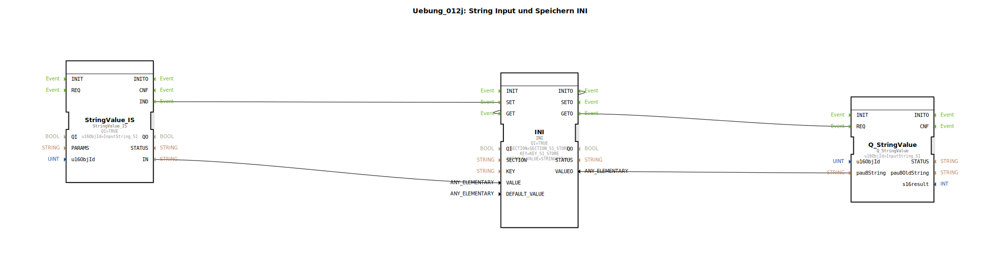

# Uebung_012j: String Input und Speichern INI

* * * * * * * * * *
## Einleitung

Diese Übung demonstriert die Verarbeitung und Speicherung eines String-Werts mittels eines **INI-Funktionsbausteins**.  
Ziel ist es, einen von einem Feldbusobjekt (ISOBUS) eingelesenen String in einer INI-Datenstruktur persistent zu speichern und anschließend wieder abzurufen.  
Die Konfiguration verwendet vordefinierte Konstanten für den Speicherabschnitt (`SECTION_S1_STORE`), den Schlüssel (`KEY_S1_STORE`) sowie die Objekt-ID des Eingabe-Strings (`InputString_S1`).

## Verwendete Funktionsbausteine (FBs)

### FB: `StringValue_IS`
- **Typ**: `isobus::UT::io::StringValue::StringValue_IS`  
- **Parameter**:
  - `QI` = `TRUE` (aktiv)
  - `u16ObjId` = `InputString_S1` (Objekt-ID des ISOBUS-String-Objekts)
- **Ereignisse**:
  - Ereignisausgang: `IND` (wird ausgelöst, wenn ein neuer Stringwert empfangen wird)
- **Daten**:
  - Datenausgang: `IN` (der gelesene String-Wert)
- **Funktionsweise**:  
  Liest bei Aktivierung den Stringwert von der spezifizierten ISOBUS-Objekt-ID (`InputString_S1`) und gibt diesen über den Ausgang `IN` sowie ein Ereignis `IND` aus.

### FB: `INI`
- **Typ**: `eclipse4diac::storage::INI`  
- **Parameter**:
  - `QI` = `TRUE` (aktiv)
  - `SECTION` = `SECTION_S1_STORE` (Abschnitt in der INI-Datei)
  - `KEY` = `KEY_S1_STORE` (Schlüssel innerhalb des Abschnitts)
  - `DEFAULT_VALUE` = `STRING#'Test'` (Standardwert, falls noch kein Eintrag existiert)
- **Ereignisse**:
  - Ereigniseingänge: `SET` (speichert den anliegenden Wert), `GET` (liest den gespeicherten Wert)
  - Ereignisausgänge: `INITO` (nach erfolgreicher Initialisierung), `GETO` (nach erfolgreichem Lesevorgang)
- **Daten**:
  - Dateneingang: `VALUE` (der zu speichernde String)
  - Datenausgang: `VALUEO` (der ausgelesene String)
- **Funktionsweise**:  
  Der FB verwaltet einen persistenten String-Wert im INI-Format. Beim Ereignis `SET` wird der anliegende `VALUE` unter dem angegebenen Schlüssel und Abschnitt gespeichert. Beim Ereignis `GET` wird der gespeicherte Wert auf `VALUEO` ausgegeben und das Ereignis `GETO` gesendet. Bei Initialisierung (`INITO`) wird automatisch ein `GET` ausgeführt.

### FB: `Q_StringValue`
- **Typ**: `isobus::UT::Q::Q_StringValue`  
- **Parameter**:
  - `u16ObjId` = `InputString_S1` (Objekt-ID – wird hier nicht direkt verwendet, aber als Kontext)
- **Ereignisse**:
  - Ereigniseingang: `REQ` (Anforderung zur Ausgabe)
- **Daten**:
  - Dateneingang: `pau8String` (der auszugebende String)
- **Funktionsweise**:  
  Nimmt einen String entgegen und stellt ihn auf dem ISOBUS-Objekt mit der angegebenen ID zur Verfügung (z. B. zur Anzeige auf einem Terminal).

## Programmablauf und Verbindungen

Der Programmablauf gliedert sich in zwei Phasen: **Initialisierung** und **zyklische Verarbeitung**.

### Ereignisverbindungen
1. **Initialisierung**:  
   Der FB `INI` erzeugt nach erfolgreicher Initialisierung das Ereignis `INITO`. Dieses wird direkt mit dem `GET`-Eingang von `INI` verbunden. Dadurch wird unmittelbar nach dem Start der gespeicherte Wert gelesen.
2. **Lesen des gespeicherten Werts**:  
   Nach dem Lesevorgang gibt `INI` das Ereignis `GETO` aus. Dieses triggert den `REQ`-Eingang von `Q_StringValue`, sodass der ausgelesene String an das ISOBUS-Objekt übergeben wird.
3. **Speichern eines neuen Werts**:  
   Wenn `StringValue_IS` einen neuen String vom ISOBUS-Objekt empfängt, sendet es das Ereignis `IND`. Dieses ist mit dem `SET`-Eingang von `INI` verbunden, sodass der neue Wert gespeichert wird.

### Datenverbindungen
- Der Ausgang `IN` von `StringValue_IS` wird mit dem Dateneingang `VALUE` von `INI` verbunden – der gelesene String wird zum Speichern weitergegeben.
- Der Ausgang `VALUEO` von `INI` wird mit dem Dateneingang `pau8String` von `Q_StringValue` verbunden – der ausgelesene String wird für die Ausgabe bereitgestellt.

### Ablaufdiagramm (vereinfacht)

1. **Start**: `INI` initialisiert → `INITO` → `GET` → liest gespeicherten Wert → `GETO` → `Q_StringValue.REQ` → Ausgabe des gespeicherten Strings.
2. **Neuer Eingang**: `StringValue_IS` empfängt neuen String → `IND` → `INI.SET` → speichert den neuen Wert.
3. Nach einem erneuten `GET` (z. B. durch zyklischen Trigger) wird der aktuell gespeicherte Wert ausgegeben.

## Zusammenfassung

Die Übung `Uebung_012j` vermittelt den Umgang mit:

- Einlesen eines String-Werts von einem ISOBUS-Objekt (`StringValue_IS`)
- Persistenter Speicherung des Werts mittels `INI`-Funktionsbaustein (Abschnitt, Schlüssel, Standardwert)
- Rückgabe des gespeicherten Werts an ein ISOBUS-Objekt (`Q_StringValue`)

Durch die Verwendung von Konstanten (`SECTION_S1_STORE`, `KEY_S1_STORE`, `InputString_S1`) wird eine klare Trennung zwischen Konfiguration und Logik erreicht. Der Ablauf zeigt eine typische Initialisierungs- und Update-Strategie für dezentrale Steuerungssysteme mit Speicherbedarf.