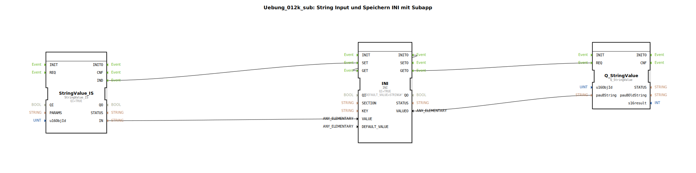

# Uebung_012k_sub: String Input und Speichern INI mit Subapp

* * * * * * * * * *

## Einleitung

Diese Übung demonstriert die Verwendung einer Subapplikation zur Verarbeitung eines String-Eingangs und dessen Speicherung in einer INI-Struktur. Die Subapp greift auf einen String-Wert (z. B. von einem CAN-Bus) zu, speichert ihn unter einem Schlüssel und einem Abschnitt (SECTION) und gibt den gespeicherten Wert über einen Ausgang sowie über einen Queue-Baustein aus. Die Objekt-ID (u16ObjId) dient der Identifikation des Datenobjekts.

## Verwendete Funktionsbausteine (FBs)

Die Subapplikation besteht aus drei internen Funktionsbausteinen:

- **StringValue_IS** (Typ: `isobus::UT::io::StringValue::StringValue_IS`)  
  Liest einen String-Wert von einem externen Interface (z. B. Isobus). Wird aktiviert, wenn ein neuer String verfügbar ist.

- **INI** (Typ: `eclipse4diac::storage::INI`)  
  Speichert einen String-Wert in einer INI-artigen Datenstruktur unter einem gegebenen Schlüssel (KEY) in einem Abschnitt (SECTION). Enthält eine Initialisierungslogik und kann Werte setzen und abrufen.

- **Q_StringValue** (Typ: `isobus::UT::Q::Q_StringValue`)  
  Ein Queue-Baustein für String-Werte. Er nimmt den gespeicherten String und die Objekt-ID entgegen und gibt ihn bei Anforderung weiter (z. B. für die Ausgabe auf den Bus).

| Bausteinname      | Typ                                                    | Parameter / Bemerkung                |
|-------------------|--------------------------------------------------------|--------------------------------------|
| StringValue_IS    | `isobus::UT::io::StringValue::StringValue_IS`          | QI = TRUE                            |
| INI               | `eclipse4diac::storage::INI`                         | QI = TRUE, DEFAULT_VALUE = ''        |
| Q_StringValue     | `isobus::UT::Q::Q_StringValue`                      | keine zusätzlichen Parameter         |

### Sub-Bausteine

Es sind keine weiteren Sub-Bausteine definiert; die oben genannten Funktionsbausteine sind die einzigen innerhalb der Subapplikation.

## Programmablauf und Verbindungen

Die Subapplikation hat folgende Schnittstellen:

- **Eingänge**:
  - `KEY` (STRING): Der Schlüssel, unter dem der Wert gespeichert wird.
  - `SECTION` (STRING): Der Abschnitt (Section) der INI-Struktur.
  - `u16ObjId` (UINT): Objekt-ID, Standardwert = ID_NULL (aus dem importierten Namespace `isobus::UT::Q::const::IDs`).
- **Ausgänge**:
  - `VALUEO` (STRING): Der aus der INI gelesene Wert.
  - `IND` (Event): Signalisiert, dass ein neuer Wert verarbeitet wurde.

**Ablauf:**

1. **Initialisierung**: Nach dem Start der Subapplikation wird beim ersten Durchlauf das Ereignis `INITO` des INI-Bausteins ausgelöst. Dieses ist intern mit dem Eingang `GET` verbunden, sodass der INI-Baustein sofort den aktuellen Wert für den gegebenen Schlüssel abruft.

2. **Eingangsverarbeitung**:
   - Über den Ereignisausgang `IND` des `StringValue_IS`-Bausteins wird der `SET`-Eingang des INI-Bausteins getriggert, sobald ein neuer String eingetroffen ist.
   - Gleichzeitig wird der String-Wert von `StringValue_IS.IN` an den `VALUE`-Eingang des INI-Bausteins übergeben.
   - Die Parameter `KEY`, `SECTION` und `u16ObjId` werden direkt von den SubApp-Eingängen an die entsprechenden Bausteine weitergeleitet (`KEY` → INI.KEY, `SECTION` → INI.SECTION, `u16ObjId` → StringValue_IS.u16ObjId und Q_StringValue.u16ObjId).

3. **Ausgabe**:
   - Nach erfolgreichem Speichern (oder Abruf) liefert der INI-Baustein das Ereignis `SETO` und/oder `GETO`.
   - Das `SETO`-Ereignis wird an den SubApp-Ausgang `IND` weitergegeben.
   - Das `GETO`-Ereignis triggert zum einen den `REQ`-Eingang des `Q_StringValue`-Bausteins, der den aktuellen String (von INI.VALUEO) und die Objekt-ID an den Queue weitergibt, und zum anderen ebenfalls den SubApp-Ausgang `IND`.

**Zusammenfassung der Verbindungen**:

- **Event-Verbindungen**:
  - `StringValue_IS.IND` → `INI.SET`
  - `INI.SETO` → `IND` (SubApp-Ausgang)
  - `INI.GETO` → `Q_StringValue.REQ` und → `IND` (SubApp-Ausgang)
  - `INI.INITO` → `INI.GET` (interne Triggerschleife)

- **Datenverbindungen**:
  - `StringValue_IS.IN` → `INI.VALUE`
  - `u16ObjId` → `Q_StringValue.u16ObjId`
  - `KEY` → `INI.KEY`
  - `INI.VALUEO` → `Q_StringValue.pau8String` und → `VALUEO` (SubApp-Ausgang)
  - `u16ObjId` → `StringValue_IS.u16ObjId`
  - `SECTION` → `INI.SECTION`

Die Subapplikation realisiert somit einen geschlossenen Kreislauf: Jeder neu eintreffende String wird gespeichert, und gleichzeitig wird der gespeicherte Wert (sowohl über `Q_StringValue` als auch direkt über den Ausgang) verfügbar gemacht.

## Zusammenfassung

Die Übung `Uebung_012k_sub` zeigt, wie eine Subapplikation aus mehreren vordefinierten Funktionsbausteinen aufgebaut wird, um einen String-Eingang in einer INI-ähnlichen Struktur zu speichern und auszugeben. Durch die Kombination von Ereignis- und Datenverbindungen wird eine robuste Verarbeitungskette erzeugt, die Initialisierung, Speichern und Abrufen integriert. Dies ist ein typisches Muster für die persistente Datenverwaltung in Automatisierungssystemen auf Basis des IEC 61499 Standards.