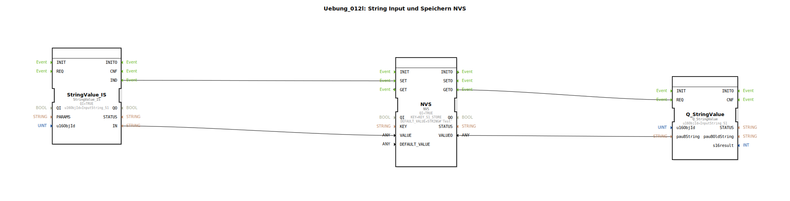

# Uebung_012l: String Input und Speichern NVS

* * * * * * * * * *

## Einleitung

Diese Übung demonstriert das Einlesen eines Strings von einer ISOBUS-Variablen (InputString_S1) und das Speichern dieses Wertes im nichtflüchtigen Speicher (NVS) eines ESP32. Beim Starten der Applikation wird der zuletzt gespeicherte String automatisch aus dem NVS geladen und an die entsprechende ISOBUS-Variable zurückgeschrieben. Somit bleibt der Wert auch nach einem Neustart erhalten.

## Verwendete Funktionsbausteine (FBs)

### StringValue_IS
- **Typ**: `isobus::UT::io::StringValue::StringValue_IS`
- **Parameter**:
  - `QI` = `TRUE`
  - `u16ObjId` = `InputString_S1`
- **Funktionsweise**: Der Baustein empfängt den aktuellen Stringwert der ISOBUS‑Objektvariablen `InputString_S1`. Wann immer sich dieser Wert ändert (z. B. durch eine Eingabe am Terminal), wird am Ereignisausgang `IND` ein Signal erzeugt und der neue String am Datenausgang `IN` bereitgestellt.

### NVS
- **Typ**: `logiBUS::storage::esp32_nvs::NVS`
- **Parameter**:
  - `QI` = `TRUE`
  - `KEY` = `KEY_S1_STORE`
  - `DEFAULT_VALUE` = `STRING#'Test'`
- **Funktionsweise**: Der Baustein verwaltet den nichtflüchtigen Speicher auf dem ESP32.  
  - Bei einem Ereignis an `SET` speichert er den an `VALUE` anliegenden String unter dem Schlüssel `KEY_S1_STORE` ab.  
  - Bei einem Ereignis an `GET` lädt er den gespeicherten String und stellt ihn am Datenausgang `VALUEO` bereit.  
  - Nach der Initialisierung (`INITO`) löst er automatisch einen `GET` aus.

### Q_StringValue
- **Typ**: `isobus::UT::Q::Q_StringValue`
- **Parameter**:
  - `u16ObjId` = `InputString_S1`
- **Funktionsweise**: Dieser Baustein schreibt („qualifiziert“) einen empfangenen String zurück in die ISOBUS‑Variable `InputString_S1`. Ein Ereignis an `REQ` übernimmt den Wert von `pau8String` und aktualisiert die ISOBUS‑Variable.

## Programmablauf und Verbindungen

### Initialisierung (Start)
1. Nach dem Start des Controllers erhält der `NVS`-Baustein das Ereignis `INITO`.
2. Dieses Ereignis wird intern mit dem Ausgang `GET` verbunden (im XML als `Connection Source="NVS.INITO" Destination="NVS.GET" …` sichtbar). Somit wird sofort ein Lesevorgang ausgelöst.
3. Der `NVS`-Baustein lädt den unter `KEY_S1_STORE` gespeicherten String (oder den Default‑Wert `"Test"`, falls noch kein Wert gespeichert wurde) und gibt ihn am Ausgang `VALUEO` aus.
4. Gleichzeitig erzeugt der `NVS` am Ausgang `GETO` ein Ereignis, das mit dem `REQ`-Eingang von `Q_StringValue` verbunden ist.
5. `Q_StringValue` übernimmt den String von `NVS.VALUEO` (via `pau8String`) und schreibt ihn in die ISOBUS‑Variable `InputString_S1`.

### Änderung des Strings (z. B. durch Terminaleingabe)
1. Sobald der Wert von `InputString_S1` von außen geändert wird (z. B. über ein Bedienterminal), erzeugt `StringValue_IS` ein Ereignis an `IND`.
2. Dieses Ereignis ist mit dem `SET`-Eingang des `NVS`-Bausteins verbunden.
3. `NVS` speichert den aktuellen String (von `StringValue_IS.IN` über die Datenverbindung an `NVS.VALUE`) unter dem Schlüssel `KEY_S1_STORE`.
4. **Hinweis:** Nach dem Speichern wird **nicht** automatisch der `Q_StringValue` aktualisiert. Die Rückschreibung in die ISOBUS‑Variable erfolgt nur beim Start. Das ist beabsichtigt, da der Wert ja bereits im Terminal sichtbar ist.

### Datenverbindungen im Überblick
- **Ereignisse**:
  - `NVS.INITO` → `NVS.GET` (initialer Lesevorgang)
  - `NVS.GETO` → `Q_StringValue.REQ` (Ausgabe des geladenen Strings)
  - `StringValue_IS.IND` → `NVS.SET` (Speicherung bei Änderung)
- **Daten**:
  - `NVS.VALUEO` → `Q_StringValue.pau8String` (zu ladender String)
  - `StringValue_IS.IN` → `NVS.VALUE` (zu speichernder String)

### Wichtige Konstanten
- **`KEY_S1_STORE`**: Der NVS‑Schlüssel, unter dem der String gespeichert wird.  
- **`InputString_S1`**: Die ID der ISOBUS‑Stringvariablen, die als Quelle und Ziel dient.

## Lernziele
- Verständnis der nichtflüchtigen Speicherung (NVS) auf ESP32‑Systemen.
- Umgang mit ISOBUS‑Stringvariablen in 4diac.
- Ereignisgesteuerte Abläufe: Initialisierung und reaktive Speicherung.
- Verwendung von vordefinierten Konstanten (Schlüssel, Objekt‑IDs).

## Benötigte Vorkenntnisse
- Grundlegende Bedienung der 4diac‑IDE.
- Grundlagen der ISOBUS‑Kommunikation (Objekt‑IDs, Werte lesen/schreiben).
- Einfaches Verständnis von ereignisgesteuerten Systemen.

## Zusammenfassung

Die Übung `Uebung_012l` zeigt, wie ein ISOBUS‑String in den NVS‑Speicher des ESP32 geschrieben und beim Systemstart wieder ausgelesen wird. Der Wert bleibt dauerhaft erhalten, auch nach einem Neustart oder Spannungsausfall. Die Applikation besteht aus drei Funktionsbausteinen, die über Ereignis- und Datenverbindungen zusammenarbeiten und demonstriert einen typischen Anwendungsfall für persistenten Variablenzugriff in der Landtechnik‑Automatisierung.