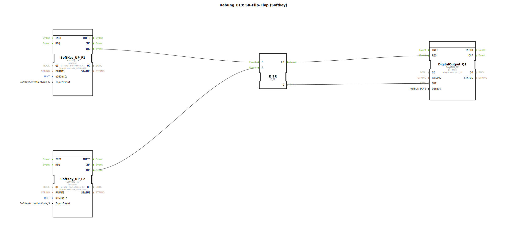

# Uebung_013: SR-Flip-Flop (Softkey)

Dieser Artikel beschreibt die logiBUS®-Übung `Uebung_013`. Hier wird eine Speicherfunktion realisiert, die vollständig über das ISOBUS-Terminal bedient wird.

## 🎧 Podcast

* [Die drei Timer der DIN EN 61131-3 entschlüsselt – TP, TON & TOF präzise erklärt](https://podcasters.spotify.com/pod/show/iec-61499-grundkurs-de/episodes/Die-drei-Timer-der-DIN-EN-61131-3-entschlsselt--TP--TON--TOF-przise-erklrt-e3dma77)
* [DIN EN 61131-3 vs. 61499-1: Dein Wegweiser durch die Normen der Industrieautomatisierung](https://podcasters.spotify.com/pod/show/iec-61499-grundkurs-de/episodes/DIN-EN-61131-3-vs--61499-1-Dein-Wegweiser-durch-die-Normen-der-Industrieautomatisierung-e36c6nc)
* [DIN EN 61131-3: Das Herz der Land- und Baumaschinen-Mechatronik und der Sprung in die Zukunft mit Ob](https://podcasters.spotify.com/pod/show/iec-61499-grundkurs-de/episodes/DIN-EN-61131-3-Das-Herz-der-Land--und-Baumaschinen-Mechatronik-und-der-Sprung-in-die-Zukunft-mit-Ob-e36c2mp)
* [FB_TOF und E_TOF: Verzögerungstimer in IEC 61131-3 und 61499](https://podcasters.spotify.com/pod/show/iec-61499-grundkurs-de/episodes/FB_TOF-und-E_TOF-Verzgerungstimer-in-IEC-61131-3-und-61499-e368e2d)
* [IEC 61499 vs. 61131: Brauchen wir einen neuen Standard für IIoT? Analyse einer hitzigen Debatte um Verteilte Intelligenz](https://podcasters.spotify.com/pod/show/iec-61499-grundkurs-de/episodes/IEC-61499-vs--61131-Brauchen-wir-einen-neuen-Standard-fr-IIoT--Analyse-einer-hitzigen-Debatte-um-Verteilte-Intelligenz-e3ahc2r)

----

## Ziel der Übung

Realisierung einer Ein/Aus-Schaltung mit getrennten virtuellen Tasten.

-----

## Beschreibung und Komponenten

[cite_start]Die Subapplikation `Uebung_013.SUB` nutzt zwei Softkeys zur Steuerung eines SR-Flip-Flops[cite: 1].

### Funktionsbausteine (FBs)

  * **`SoftKey_UP_F1`**: Triggert beim Loslassen (Release) den Set-Eingang (`S`).
  * **`SoftKey_UP_F2`**: Triggert beim Loslassen (Release) den Reset-Eingang (`R`).
  * **`E_SR`**: Der Speicherbaustein.
  * **`DigitalOutput_Q1`**: Der Hardware-Ausgang.

-----

## Funktionsweise

*   Ein Klick auf **F1** schaltet die Funktion ein.
*   Ein Klick auf **F2** schaltet die Funktion aus.

Die Verwendung von `SK_RELEASED` sorgt für ein stabiles Bediengefühl am Touchscreen. Da zwei getrennte Tasten verwendet werden, ist der Zustand der Anlage für den Bediener immer eindeutig steuerbar.

-----

## Anwendungsbeispiel

**Zuschalten eines Anbaugeräts**:
Am Terminal gibt es zwei deutliche Symbole: Ein grüner Haken (`F1`) für "System Aktiv" und ein rotes Kreuz (`F2`) für "System Deaktiviert". Der Speicher in der Steuerung sorgt dafür, dass die gewählte Betriebsart erhalten bleibt, bis die jeweils andere Taste gedrückt wird.