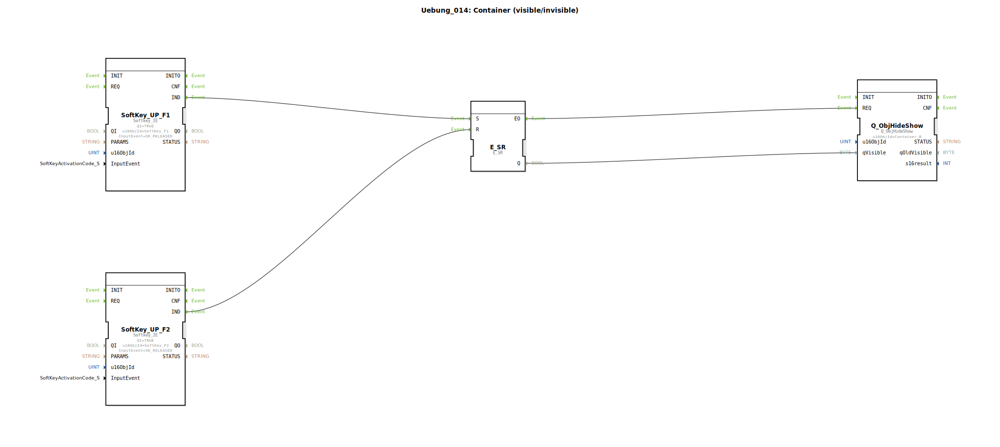

# Uebung_014: Container (visible/invisible)

Dieser Artikel beschreibt die logiBUS®-Übung `Uebung_014`. Hier wird gezeigt, wie man die Benutzeroberfläche des ISOBUS-Terminals dynamisch verändert, indem ganze Gruppen von Objekten (Container) sichtbar oder unsichtbar geschaltet werden.

## 🎧 Podcast

* [4diac IDE: Dein Open-Source-Werkzeugkasten für verteilte Industrieautomatisierung nach IEC 61499](https://podcasters.spotify.com/pod/show/eclipse-4diac-de/episodes/4diac-IDE-Dein-Open-Source-Werkzeugkasten-fr-verteilte-Industrieautomatisierung-nach-IEC-61499-e36821e)
* [4diac IDE: Wie der IEC 61499 Standard die Industrieautomatisierung revolutioniert](https://podcasters.spotify.com/pod/show/eclipse-4diac-de/episodes/4diac-IDE-Wie-der-IEC-61499-Standard-die-Industrieautomatisierung-revolutioniert-e36756a)
* [Eclipse 4diac FORTE: IEC 61499 verstehen – Der LEGO®-Baukasten für Ihre Industrie 4.0 Steuerung](https://podcasters.spotify.com/pod/show/eclipse-4diac-de/episodes/Eclipse-4diac-FORTE-IEC-61499-verstehen--Der-LEGO-Baukasten-fr-Ihre-Industrie-4-0-Steuerung-e3682kc)
* [Eclipse 4diac: Open-Source-Automatisierung für Industrie und Forschung nach IEC 61499](https://podcasters.spotify.com/pod/show/eclipse-4diac-de/episodes/Eclipse-4diac-Open-Source-Automatisierung-fr-Industrie-und-Forschung-nach-IEC-61499-e38b4na)
* [IEC 61499: Die Zukunft der industriellen Automatisierung und verteilten Systeme](https://podcasters.spotify.com/pod/show/eclipse-4diac-de/episodes/IEC-61499-Die-Zukunft-der-industriellen-Automatisierung-und-verteilten-Systeme-e369739)

----

## Ziel der Übung

Verwendung des Bausteins `Q_ObjHideShow` zur Steuerung der Sichtbarkeit von ISOBUS-Objekten. Dies ermöglicht es, kontextsensitive Oberflächen zu erstellen, die nur die Informationen anzeigen, die im aktuellen Betriebszustand relevant sind.

-----

## Beschreibung und Komponenten

[cite_start]Die Subapplikation `Uebung_014.SUB` nutzt zwei Softkeys, um einen Speicher zu setzen oder zu löschen, dessen Zustand die Sichtbarkeit eines Containers steuert[cite: 1].

### Funktionsbausteine (FBs)

  * **`SoftKey_UP_F1` & `F2`**: Eingabe am Terminal (Ein/Aus).
  * **`E_SR`**: Der Speicher für den Sichtbarkeits-Status.
  * **`Q_ObjHideShow`**: Der ISOBUS-Ausgangsbaustein. [cite_start]Er steuert die Eigenschaft "Sichtbarkeit" des Objekts mit der ID `Container_B`[cite: 1].

-----

## Funktionsweise

1.  Ein Klick auf **F1** setzt den Speicher auf `TRUE`.
2.  Ein Klick auf **F2** setzt den Speicher auf `FALSE`.
3.  Das jeweilige Ereignis (`EO`) triggert den `REQ`-Eingang von `Q_ObjHideShow`.
4.  Der Baustein übermittelt den Zustand von `qVisible` an das Terminal.
5.  Alle Objekte, die sich im ISOBUS-Pool innerhalb des `Container_B` befinden, erscheinen oder verschwinden nun zeitgleich auf dem Bildschirm.

-----

## Anwendungsbeispiel

**Optionale Ausstattungsmerkmale**:
Eine Maschine kann mit oder ohne Wiegeeinrichtung bestellt werden. In der Software ist die Wiege-Anzeige in einem Container gruppiert. Je nach Konfiguration (oder Knopfdruck) wird dieser gesamte Bereich ein- oder ausgeblendet, sodass der Bediener nicht durch inaktive Felder abgelenkt wird.