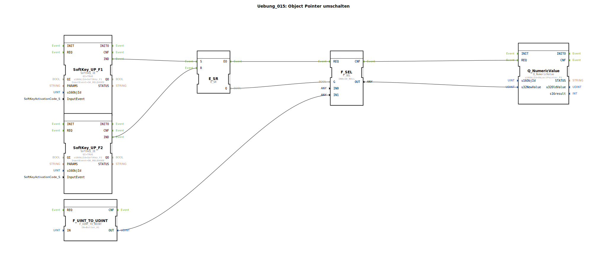

# Uebung_015: Object Pointer umschalten

Dieser Artikel beschreibt die logiBUS®-Übung `Uebung_015`. Hier wird eine fortgeschrittene ISOBUS-Technik demonstriert: Das Umschalten von Object Pointern, um Bildschirminhalte dynamisch auszutauschen.

## 🎧 Podcast

* [Als Landtechnik-Spezialist durch die Hölle: Wie Lanz-Wery Krieg, Besatzung und Hyperinflation überlebte – Einblicke in Original-Geschäftsberichte 1915-1922](https://podcasters.spotify.com/pod/show/ms-muc-lama/episodes/Als-Landtechnik-Spezialist-durch-die-Hlle-Wie-Lanz-Wery-Krieg--Besatzung-und-Hyperinflation-berlebte--Einblicke-in-Original-Geschftsberichte-1915-1922-e39athj)
* [Hannes' Turbo-Mais: Wie ein Landwirt mit Hackschnitzel-Kreislauf und Turmtrockner 15.000 Tonnen Körnermais verarbeitet](https://podcasters.spotify.com/pod/show/ms-muc-lama/episodes/Hannes-Turbo-Mais-Wie-ein-Landwirt-mit-Hackschnitzel-Kreislauf-und-Turmtrockner-15-000-Tonnen-Krnermais-verarbeitet-e3a5e0o)
* [JBC Lötspitzen C470 vs. C245 vs. C210 vs. C115: Welche Spitze ist der Allrounder und wann brauchst du den Nano-Spezialisten?](https://podcasters.spotify.com/pod/show/ms-muc-lama/episodes/JBC-Ltspitzen-C470-vs--C245-vs--C210-vs--C115-Welche-Spitze-ist-der-Allrounder-und-wann-brauchst-du-den-Nano-Spezialisten-e39ak58)
* [Schlüter 1500 Spezial: Turbo-Giftigkeit, 40 Jahre und die Seele eines Kraftprotzes](https://podcasters.spotify.com/pod/show/ms-muc-lama/episodes/Schlter-1500-Spezial-Turbo-Giftigkeit--40-Jahre-und-die-Seele-eines-Kraftprotzes-e39au2l)

----

## Ziel der Übung

Erlernen der Verwendung von `Object Pointer` Objekten. Ein Pointer ist ein Platzhalter auf dem Bildschirm, dem zur Laufzeit die ID eines anderen Objekts zugewiesen werden kann. Dies ist effizienter als das Ausblenden vieler Einzelobjekte.

-----

## Beschreibung und Komponenten

[cite_start]In `Uebung_015.SUB` wird ein Object Pointer (`ObjectPointer_P1`) zwischen einer Schaltfläche (`Button_A1`) und einem leeren Zustand (`ID_NULL`) umgeschaltet[cite: 1].

### Funktionsbausteine (FBs)

  * **`SoftKey_UP_F1` & `F2`**: Steuern die Auswahl.
  * **`F_SEL`**: Ein Auswahl-Baustein (Selection). [cite_start]Je nach Eingang `G` (vom Speicher `E_SR`) gibt er entweder den Wert `ID_NULL` (0) oder die Objekt-ID von `Button_A1` aus[cite: 1].
  * **`Q_NumericValue`**: Wird hier zweckentfremdet, um die ID an den Pointer zu senden (da ein Pointer-Update technisch das Senden einer neuen ID an die Pointer-Objekt-ID ist).

-----

## Funktionsweise

1.  Nutzer drückt **F1** ➡️ Speicher wird `TRUE` ➡️ `F_SEL` schaltet `Button_A1` durch.
2.  Die ID von `Button_A1` wird an `ObjectPointer_P1` gesendet.
3.  Auf dem Bildschirm erscheint an der Position des Pointers plötzlich die Schaltfläche `A1`.
4.  Nutzer drückt **F2** ➡️ ID `0` wird gesendet ➡️ Die Stelle auf dem Bildschirm wird wieder leer.

-----

## Anwendungsbeispiel

**Kontextsensitive Buttons**:
Ein zentraler Platz auf dem Terminal soll je nach Arbeitsmodus unterschiedliche Funktionen anzeigen (z.B. im Modus "Transport" ein Straßensymbol, im Modus "Feld" ein Pflugsymbol). Anstatt zwei Buttons übereinander zu legen und zu verstecken, wird ein Pointer genutzt, der je nach Modus auf das eine oder andere Bild-Objekt verweist.