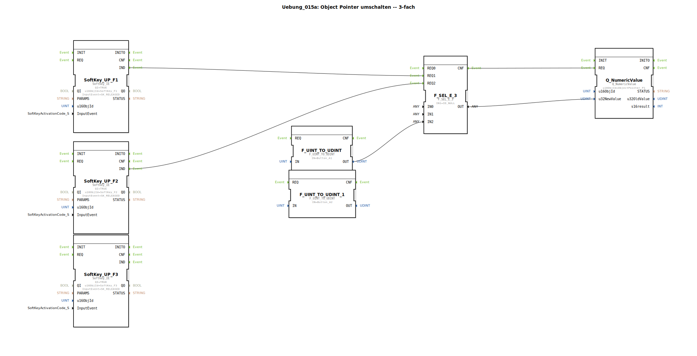

# Uebung_015a: Object Pointer umschalten -- 3-fach

Dieser Artikel beschreibt die logiBUS®-Übung `Uebung_015a`.

----

## Übersicht

[cite_start]Diese Übung erweitert das Pointer-Konzept aus Übung 015 auf drei Zustände unter Verwendung des Bausteins `F_SEL_E_3`[cite: 1].
Über drei Softkeys (`F1`, `F2`, `F3`) kann der Nutzer entscheiden, was an einer bestimmten Stelle auf dem Bildschirm angezeigt wird:
1.  Nichts (`ID_NULL`)
2.  Schaltfläche `Button_A1`
3.  Schaltfläche `Button_A2`

Dies demonstriert die Flexibilität von Pointern bei der Erstellung von dynamischen Menüstrukturen oder umschaltbaren Info-Bereichen.

