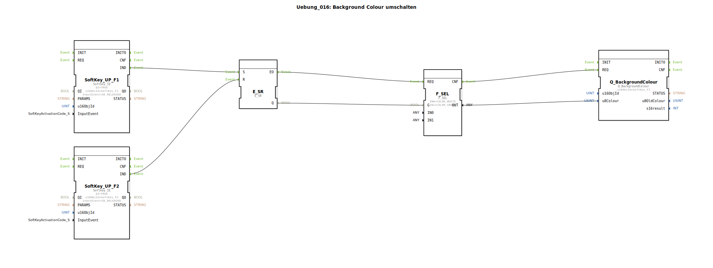

# Uebung_016: Background Colour umschalten

Dieser Artikel beschreibt die logiBUS®-Übung `Uebung_016`. Hier wird gezeigt, wie man die Hintergrundfarbe von Objekten (z.B. Softkeys) zur Laufzeit ändert, um Zustände zu visualisieren.

## 🎧 Podcast

* [ESP32-S3-DevKitC-1 Doku-Analyse: Das Speicher-Monster (32MB Flash/16MB PSRAM) und die Macht der Dual-USB-Ports](https://podcasters.spotify.com/pod/show/ms-muc-lama/episodes/ESP32-S3-DevKitC-1-Doku-Analyse-Das-Speicher-Monster-32MB-Flash16MB-PSRAM-und-die-Macht-der-Dual-USB-Ports-e39hamt)

----

## Ziel der Übung

Verwendung des Bausteins `Q_BackgroundColour`. Dies ist eine Alternative zum Farbumschlag in Sub-Applikationen (wie in Übung 010c) und erlaubt die explizite Wahl von Farben aus der ISOBUS-Palette.

-----

## Beschreibung und Komponenten

[cite_start]Die Subapplikation `Uebung_016.SUB` schaltet die Farbe des Softkeys `F7` basierend auf der Auswahl über `F1` und `F2` um[cite: 1].

### Funktionsbausteine (FBs)

  * **`F_SEL`**: Wählt zwischen zwei Farb-Konstanten aus.
  * **`Q_BackgroundColour`**: Der Ausgangsbaustein. [cite_start]Er setzt die Hintergrundfarbe für das Objekt `SoftKey_F7`[cite: 1].

-----

## Funktionsweise

*   Wird der Speicher durch **F1** gesetzt, liefert `F_SEL` den Wert `COLOR_GREEN`.
*   Wird er durch **F2** gelöscht, liefert `F_SEL` den Wert `COLOR_WHITE`.
*   Das Ergebnis wird an `Q_BackgroundColour` gesendet, welches das entsprechende ISOBUS-Kommando ("Change Background Colour") an das Terminal absetzt.

Der Softkey `F7` (der in dieser Übung keine eigene Logik hat, sondern nur als Anzeige dient) wechselt nun zwischen Grün und Weiß.

-----

## Anwendungsbeispiel

**Status-Ampel**:
Ein Sensor überwacht einen Füllstand. Ist alles im grünen Bereich, leuchtet eine Anzeige am Terminal grün. Erreicht der Stand eine kritische Marke, schaltet die Anzeige auf Gelb oder Rot um, um den Bediener visuell zu warnen.