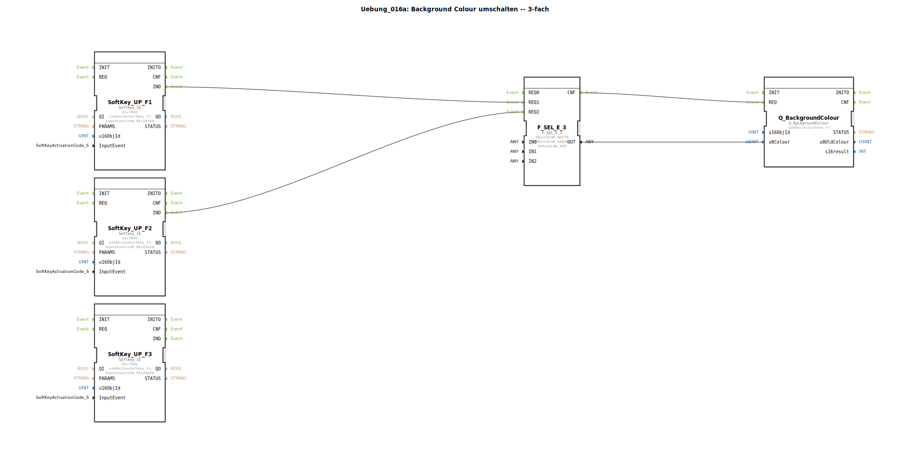

# Uebung_016a: Background Colour umschalten -- 3-fach

Dieser Artikel beschreibt die logiBUS®-Übung `Uebung_016a`.

----

## Übersicht

[cite_start]Diese Übung erweitert das Farb-Umschaltkonzept auf drei Farben unter Verwendung von `F_SEL_E_3`[cite: 1]. Über drei Softkeys kann der Hintergrund eines Objekts (`SoftKey_F7`) direkt auf **Weiß**, **Grün** oder **Rot** gesetzt werden. Dies ist die Grundlage für komplexere Ampel-Logiken oder differenzierte Statusmeldungen am Universal Terminal.