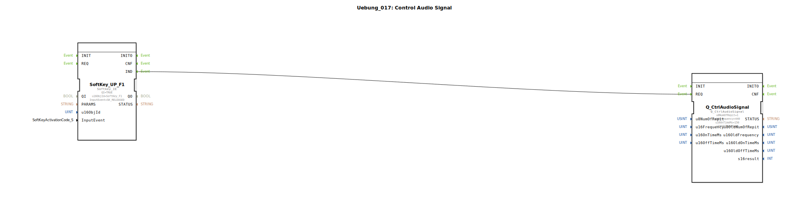

# Uebung_017: Control Audio Signal

Dieser Artikel beschreibt die logiBUS®-Übung `Uebung_017`. In dieser Übung wird gezeigt, wie man den internen Summer des ISOBUS-Terminals anspricht, um akustische Rückmeldungen zu geben.

## 🎧 Podcast

* ["Store Version" – Dein Schlüssel zur Verwaltung von Objektdatenpools im nichtflüchtigen VT-Speicher (ISO 11783-6)](https://podcasters.spotify.com/pod/show/isobus-vt-objects/episodes/Store-Version--Dein-Schlssel-zur-Verwaltung-von-Objektdatenpools-im-nichtflchtigen-VT-Speicher-ISO-11783-6-e36vfh0)
* [ISO 11783-6: Softkeys und das Virtual Terminal verstehen – Dein Schlüssel zur Landmaschinen-Mechatronik](https://podcasters.spotify.com/pod/show/isobus-vt-objects/episodes/ISO-11783-6-Softkeys-und-das-Virtual-Terminal-verstehen--Dein-Schlssel-zur-Landmaschinen-Mechatronik-e36a8b0)
* [ISOBUS Skalierung: Wenn der Ackerschlepper-Bildschirm nicht passt – Eine Einführung in ISO 11783-6](https://podcasters.spotify.com/pod/show/isobus-vt-objects/episodes/ISOBUS-Skalierung-Wenn-der-Ackerschlepper-Bildschirm-nicht-passt--Eine-Einfhrung-in-ISO-11783-6-e36a8q6)
* [ISOBUS-Balkendiagramm: Das Output Linear Bar Graph Objekt der ISO 11783-6 entschlüsselt](https://podcasters.spotify.com/pod/show/isobus-vt-objects/episodes/ISOBUS-Balkendiagramm-Das-Output-Linear-Bar-Graph-Objekt-der-ISO-11783-6-entschlsselt-e36l0v2)
* [ISOBUS-Bedienoberflächen: Wenn Tasten und Hauptanzeige unterschiedlich skalieren – ISO 11783-6 entschlüsselt](https://podcasters.spotify.com/pod/show/isobus-vt-objects/episodes/ISOBUS-Bedienoberflchen-Wenn-Tasten-und-Hauptanzeige-unterschiedlich-skalieren--ISO-11783-6-entschlsselt-e36a8n8)

----

## Ziel der Übung

Verwendung des Bausteins `Q_CtrlAudioSignal`. Es wird demonstriert, wie ein Ereignis (hier ein Softkey-Klick) eine Audio-Ausgabe am Terminal mit spezifischer Frequenz und Dauer auslöst.

-----

## Beschreibung und Komponenten

[cite_start]Die Subapplikation `Uebung_017.SUB` löst bei Betätigung eines Softkeys ein Tonsignal aus[cite: 1].

### Funktionsbausteine (FBs)

  * **`SoftKey_UP_F1`**: Der Auslöser.
  * **`Q_CtrlAudioSignal`**: Der ISOBUS-Ausgangsbaustein für Audio.
  * **Parameter**:
    * `u16Frequency`: Tonhöhe in Hertz (hier 440 Hz = Kammerton A).
    * `u16OnTimeMs`: Dauer des Tons (150 ms).
    * `u8NumOfRepit`: Anzahl der Wiederholungen (1).

-----

## Funktionsweise

Die Kette ist rein ereignisbasiert:
Ein Klick (und Loslassen) von Softkey **F1** feuert ein `IND`-Event. Dieses geht direkt an den `REQ`-Eingang des Audio-Bausteins. Das Terminal erhält daraufhin den Befehl, einmalig für 150ms mit 440 Hz zu piepsen.

-----

## Anwendungsbeispiel

**Tastenton-Quittierung**:
Jeder Tastendruck am Terminal soll durch einen kurzen, dezenten Piepston bestätigt werden. Dies gibt dem Bediener eine akustische Rückmeldung über die erfolgreiche Eingabe, auch wenn er nicht direkt auf den Bildschirm schaut.