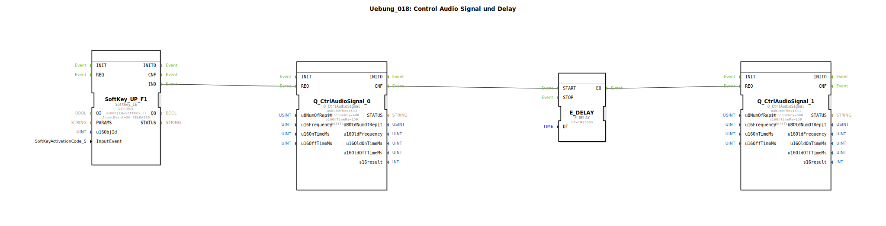

# Uebung_018: Control Audio Signal und Delay

Dieser Artikel beschreibt die logiBUS®-Übung `Uebung_018`. Hier wird die Audio-Ausgabe erweitert, um zeitlich versetzte Tonfolgen zu erzeugen.

## 📺 Video

* [Der Katalog von 1863](https://www.youtube.com/watch?v=fk7tIjl2pTk)

## 🎧 Podcast

* [Agrar-Revolution 1883: Wie Max Eyth Englands Landwirtschaft modernisierte](https://podcasters.spotify.com/pod/show/ms-muc-lama/episodes/Agrar-Revolution-1883-Wie-Max-Eyth-Englands-Landwirtschaft-modernisierte-e36faae)
* [Apfelwein-Allzweckwaffe und Stickstoff-Revolution: Die Landwirtschaft Mittelfrankens 1892 im Zeitungs-Check](https://podcasters.spotify.com/pod/show/ms-muc-lama/episodes/Apfelwein-Allzweckwaffe-und-Stickstoff-Revolution-Die-Landwirtschaft-Mittelfrankens-1892-im-Zeitungs-Check-e39auu2)
* [Das Technologie-Panorama von 1863: Lanz & Comp. und die Revolution der deutschen Landwirtschaft durch Import, Innovation und Guano](https://podcasters.spotify.com/pod/show/ms-muc-lama/episodes/Das-Technologie-Panorama-von-1863-Lanz--Comp--und-die-Revolution-der-deutschen-Landwirtschaft-durch-Import--Innovation-und-Guano-e39auqa)

----

## Ziel der Übung

Erlernen der Ereignisverzögerung (`E_DELAY`) zur Erstellung von Sequenzen. Es wird gezeigt, wie man zwei Töne mit unterschiedlichen Frequenzen nacheinander abspielt.

-----

## Beschreibung und Komponenten

[cite_start]In `Uebung_018.SUB` werden zwei Audio-Bausteine über ein Zeitglied verkettet[cite: 1].

### Funktionsbausteine (FBs)

  * **`Q_CtrlAudioSignal_0`**: Erster Ton (440 Hz).
  * **`E_DELAY`**: Ein Verzögerungs-Baustein. [cite_start]Er wartet nach einem Ereignis am Eingang `START` die Zeit `DT` ab (hier 250 ms), bevor er das Ereignis am Ausgang `EO` weitergibt[cite: 1].
  * **`Q_CtrlAudioSignal_1`**: Zweiter Ton (880 Hz - eine Oktave höher).

-----

## Funktionsweise

1.  Softkey-Klick startet Ton 0.
2.  Gleichzeitig mit dem Start des ersten Tons (oder nach dessen Bestätigung `CNF`) wird der Timer `E_DELAY` gestartet.
3.  Während der erste Ton klingt (150ms) und die kurze Pause danach, läuft die Zeit ab.
4.  Nach 250ms feuert der Timer und startet den zweiten (höheren) Ton.

Das Ergebnis ist ein zweistufiges "Didi"-Signal.

-----

## Anwendungsbeispiel

**Differenzierte Warnsignale**:
Ein kurzes "Piep" ist eine normale Info. Ein "Piep-Piep" (z.B. tiefer Ton gefolgt von hohem Ton) signalisiert das Ende eines Vorgangs. Ein umgekehrtes Signal (hoch nach tief) könnte eine Fehlermeldung akustisch untermalen.