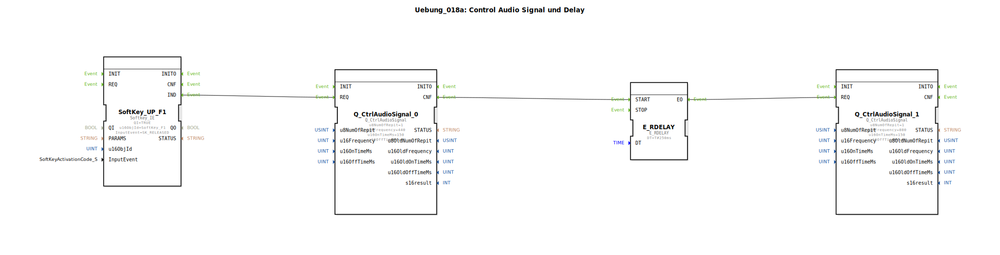

Hier ist die Dokumentation für die Übung `Uebung_018a` im gewünschten Format.

# Uebung_018a: Control Audio Signal und Delay

* * * * * * * * * *

## Einleitung
Diese Übung demonstriert die Steuerung von Audiosignalen in einer ISOBUS-Universal-Terminal-Umgebung in Kombination mit einer Zeitverzögerung. Ziel ist es, beim Loslassen einer Softkey-Taste eine Sequenz aus zwei unterschiedlichen Tönen abzuspielen, die durch eine kurze Pause getrennt sind. Dies veranschaulicht die Ereignisverarbeitung und die Verwendung von Delay-Bausteinen zur Sequenzierung von Aktionen.

## Verwendete Funktionsbausteine (FBs)

In dieser SubApplikation werden verschiedene Funktionsbausteine instanziiert und verschaltet, um die gewünschte Logik zu realisieren.

### Sub-Bausteine:

#### **SoftKey_UP_F1**
- **Typ**: `isobus::UT::io::Softkey::Softkey_IE`
- **Beschreibung**: Dieser Baustein überwacht die Eingabe am Universal Terminal (UT) für eine spezifische Softkey-Taste.
- **Konfiguration**:
    - **Parameter**: `QI` = `TRUE` (Aktiviert den Baustein)
    - **Parameter**: `u16ObjId` = `SoftKey_F1` (Identifikator der Taste F1)
    - **Parameter**: `InputEvent` = `SK_RELEASED` (Reagiert auf das Loslassen der Taste)
- **Ereignisausgang**: `IND` (Signalisiert, dass das Ereignis eingetreten ist)

#### **Q_CtrlAudioSignal_0**
- **Typ**: `isobus::UT::Q::Q_CtrlAudioSignal`
- **Beschreibung**: Erzeugt das erste akustische Signal (tieferer Ton).
- **Konfiguration**:
    - **Parameter**: `u8NumOfRepit` = `1` (Einmaliges Abspielen)
    - **Parameter**: `u16Frequency` = `440` (Frequenz in Hz - Kammerton A)
    - **Parameter**: `u16OnTimeMs` = `150` (Dauer des Tons in Millisekunden)
    - **Parameter**: `u16OffTimeMs` = `0`
- **Ereigniseingang**: `REQ` (Startet die Tonausgabe)
- **Ereignisausgang**: `CNF` (Bestätigt die Verarbeitung)

#### **E_RDELAY**
- **Typ**: `iec61499::events::E_RDELAY`
- **Beschreibung**: Ein Verzögerungsbaustein, der das Weiterleiten eines Ereignisses um eine definierte Zeit verschiebt.
- **Konfiguration**:
    - **Parameter**: `DT` = `T#250ms` (Verzögerungszeit von 250 Millisekunden)
- **Ereigniseingang**: `START` (Startet den Timer)
- **Ereignisausgang**: `EO` (Feuert nach Ablauf der Zeit)

#### **Q_CtrlAudioSignal_1**
- **Typ**: `isobus::UT::Q::Q_CtrlAudioSignal`
- **Beschreibung**: Erzeugt das zweite akustische Signal (höherer Ton).
- **Konfiguration**:
    - **Parameter**: `u8NumOfRepit` = `1` (Einmaliges Abspielen)
    - **Parameter**: `u16Frequency` = `880` (Frequenz in Hz - eine Oktave höher)
    - **Parameter**: `u16OnTimeMs` = `150` (Dauer des Tons in Millisekunden)
    - **Parameter**: `u16OffTimeMs` = `0`
- **Ereigniseingang**: `REQ` (Startet die Tonausgabe)

## Programmablauf und Verbindungen

Der Ablauf der Übung ist sequenziell aufgebaut und wird durch Benutzerinteraktion gestartet:

1.  **Start:** Der Benutzer lässt die Softkey-Taste **F1** am Terminal los. Dies wird vom Baustein `SoftKey_UP_F1` erkannt.
2.  **Erster Ton:** Das Ereignis `IND` des Softkeys triggert den Eingang `REQ` von `Q_CtrlAudioSignal_0`. Ein Ton mit **440 Hz** wird für 150 ms abgespielt.
3.  **Verzögerung:** Sobald der Befehl für den ersten Ton verarbeitet wurde (`CNF`), wird der Verzögerungsbaustein `E_RDELAY` gestartet.
4.  **Wartezeit:** Es verstreichen **250 ms** (Parameter `DT`).
5.  **Zweiter Ton:** Nach Ablauf der Wartezeit sendet `E_RDELAY` ein Signal über `EO`. Dieses Ereignis aktiviert `Q_CtrlAudioSignal_1`, welcher einen Ton mit **880 Hz** für 150 ms abspielt.

Dies erzeugt eine akustische Rückmeldung in Form einer aufsteigenden Tonfolge (Low-High) mit einer kurzen Pause dazwischen.

## Zusammenfassung
Die Übung `Uebung_018a` vermittelt grundlegende Kenntnisse über die Verkettung von Ereignissen (Event Chaining) in IEC 61499. Sie zeigt praktisch, wie man eine sequentielle Logik aufbaut, bei der eine Aktion (Tonausgabe 1) die nächste Aktion (Verzögerung -> Tonausgabe 2) auslöst, ohne dass der Benutzer erneut eingreifen muss.