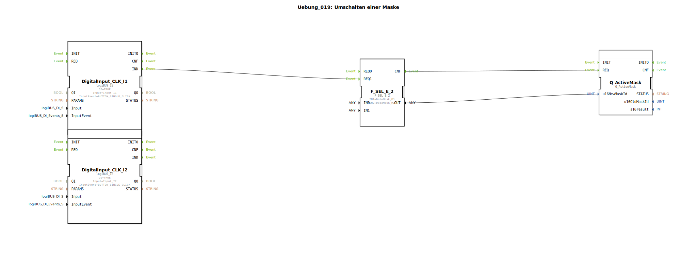

# Uebung_019: Umschalten einer Maske

Dieser Artikel beschreibt die logiBUS®-Übung `Uebung_019`. Hier wird gezeigt, wie das Programm die aktive Anzeige (Data Mask) auf dem Terminal umschalten kann.

## 📺 Video

* [Landwirtschaft 1906](https://www.youtube.com/watch?v=rqX10EiEiNM)

## 🎧 Podcast

* [Als Landtechnik-Spezialist durch die Hölle: Wie Lanz-Wery Krieg, Besatzung und Hyperinflation überlebte – Einblicke in Original-Geschäftsberichte 1915-1922](https://podcasters.spotify.com/pod/show/ms-muc-lama/episodes/Als-Landtechnik-Spezialist-durch-die-Hlle-Wie-Lanz-Wery-Krieg--Besatzung-und-Hyperinflation-berlebte--Einblicke-in-Original-Geschftsberichte-1915-1922-e39athj)
* [Land- und Forstwirtschaft 4.0: Das Fundament der Sicherheit – Analyse der DIN EN ISO 25119-1 und der](https://podcasters.spotify.com/pod/show/ms-muc-lama/episodes/Land--und-Forstwirtschaft-4-0-Das-Fundament-der-Sicherheit--Analyse-der-DIN-EN-ISO-25119-1-und-der-e39kn2f)
* [RASE: How 19th-Century England Revolutionized Agriculture Through "Practice with Science"](https://podcasters.spotify.com/pod/show/ms-muc-lama/episodes/RASE-How-19th-Century-England-Revolutionized-Agriculture-Through-Practice-with-Science-e36eb1v)
* [Rudolf Diesel: Geniales Werk, mysteriöses Ende – Wer verschwand 1913 auf der Fähre?](https://podcasters.spotify.com/pod/show/ms-muc-lama/episodes/Rudolf-Diesel-Geniales-Werk--mysterises-Ende--Wer-verschwand-1913-auf-der-Fhre-e396oa6)
* [Smart Farming Vision 1991 Auernhammers Blaupausen](https://podcasters.spotify.com/pod/show/ms-muc-lama/episodes/Smart-Farming-Vision-1991-Auernhammers-Blaupausen-e3b09r2)

----

## Ziel der Übung

Verwendung des Bausteins `Q_ActiveMask` zur Navigation auf dem Terminal. Es wird demonstriert, wie physische Taster genutzt werden, um zwischen verschiedenen Bedien-Seiten zu blättern.

-----

## Beschreibung und Komponenten

[cite_start]Die Subapplikation `Uebung_019.SUB` nutzt zwei physische Taster, um zwischen zwei Arbeitsmasken zu wählen[cite: 1].

### Funktionsbausteine (FBs)

  * **`I1` & `I2`**: Physische Eingangs-Taster.
  * **`F_SEL_E_2`**: Ein Ereignis-Selektor. Er hat zwei `REQ`-Eingänge und gibt beim jeweiligen Trigger die zugeordnete Konstante am Datenausgang aus.
  * **`Q_ActiveMask`**: Der ISOBUS-Ausgangsbaustein. [cite_start]Er sendet den Befehl zum Wechseln der Maske an das Terminal[cite: 1].

-----

## Funktionsweise

*   Druck auf **Taster 1** ➡️ `F_SEL_E_2` liefert die ID von `DataMask_M1` ➡️ `Q_ActiveMask` schaltet das Terminal auf Seite 1.
*   Druck auf **Taster 2** ➡️ `F_SEL_E_2` liefert die ID von `DataMask_M2` ➡️ `Q_ActiveMask` schaltet das Terminal auf Seite 2.

Das System steuert hier also aktiv, was der Bediener sieht.

-----

## Anwendungsbeispiel

**Kontextabhängige Steuerung**:
Wenn der Fahrer am physischen Bedienpult den Schalter für "Pflugbetrieb" umlegt, wechselt das Terminal automatisch von der Straßenansicht zur Feldansicht mit allen relevanten Tiefeneinstellungen. Dies erspart dem Fahrer das manuelle Suchen der richtigen Seite am Touchscreen während der Fahrt.